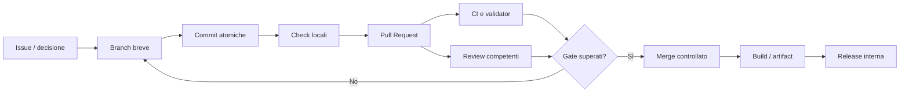
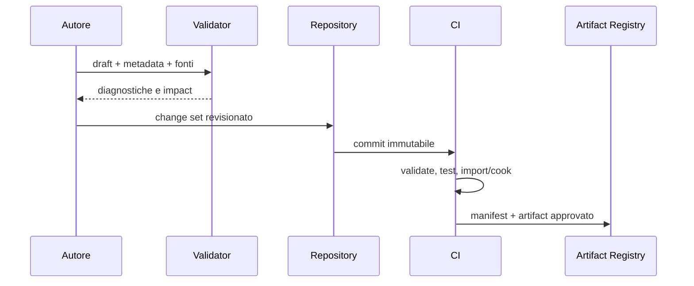

# Pipeline di sviluppo, contenuti e release

**ID:** TECH-PIPELINE-OVERVIEW
**Stato:** S3 — policy logica definita, infrastruttura e branch protection da approvare

## Scopo

Definire il percorso verificabile che porta documentazione, dati, codice futuro e asset sorgente da una modifica locale a una release interna riproducibile.

## Descrizione

La pipeline applica change review, automazione, tracciabilità e separazione tra sorgenti, artifact derivati e build. Ogni artifact pubblicato deve poter essere ricondotto a commit, configurazione, versione degli schemi, dipendenze e risultati dei gate.

## Ambito

Git, branch, commit, Pull Request, code review, CI, build, test, analisi statica, gestione e naming asset, release interne, documentazione e versionamento degli asset pesanti. Non include implementazione della CI, file Unreal, codice o asset.

## Modello dei repository e dei branch

| Elemento | Funzione | Policy proposta |
|---|---|---|
| `main` | baseline integrata e rilasciabile | protetta, nessun push diretto, merge solo dopo gate |
| `codex/game-bible-documentation-architecture` | linea documentale corrente | sola documentazione fino al gate di implementazione |
| `codex/pompeii-implementation` | futura fondazione tecnica | da creare solo dopo autorizzazione esplicita al codice |
| branch brevi `codex/<scope>` | feature/fix/docs circoscritti | origine approvata, vita breve, merge tramite PR |
| tag immutabili | release interne | manifest e artifact conservati |

Lo stato corrente del repository usa il branch documentale anche come default remoto. La creazione/protezione di `main` è una decisione amministrativa aperta, non viene eseguita da questa attività.

## Ciclo della modifica

## Git e commit

- Una commit contiene un cambiamento coerente, non mescola refactor, asset e decisioni non correlate.
- Prefissi raccomandati: `docs:`, `feat:`, `fix:`, `test:`, `build:`, `chore:`; il messaggio descrive l'esito, non l'attività generica.
- File generati, cache, Derived Data Cache, build locali, credenziali e log non entrano nel repository.
- Rename/move preservano storia e aggiornano riferimenti nello stesso change set.
- Ogni modifica a schema, salvataggio o formato asset include compatibilità, migrazione e rollback.
- Commit firmate e regole di firma restano decisione di sicurezza aperta.

## Pull Request e code review

La PR contiene scopo/non-scopo, issue o ADR, aree impattate, prove, rischi, migrazioni, screenshot/capture quando pertinenti e piano di rollback. Almeno un reviewer competente approva; cambi storici sensibili, schema/save, sicurezza, performance o asset pipeline richiedono anche l'owner del dominio. L'autore non auto-approva. Commenti bloccanti sono risolti o esplicitamente accettati dall'owner.

`main` dovrà richiedere PR, review e status check; il merge automatico non è il comportamento predefinito del progetto. La [documentazione ufficiale di riferimento](pipeline-official-sources.md) distingue policy proposta e capacità effettive di GitHub.

## Matrice CI

| Stage | Documentazione | Dati/asset | Codice futuro | Gate |
|---|---|---|---|---|
| Preflight | whitespace, encoding, file policy | manifest e LFS pointers | format/config | bloccante |
| Structure | link, README, sezioni, Mermaid | naming, path, metadata | dipendenze moduli | bloccante |
| Validation | termini, ID, claim/fonti | schema, refs, budget | static analysis | bloccante |
| Tests | esempi e cataloghi | import/cook smoke | unit/integration/automation | bloccante |
| Performance | dimensioni/costo stimato | residency e cook trend | benchmark selezionati | soglia + waiver |
| Package | sito/report | bundle validati | build/cook/package | per release |
| Publish | artifact audit | source manifest | simboli e build manifest | ambiente autorizzato |

Check veloci precedono quelli costosi. Fallimenti producono diagnostiche riproducibili e artifact limitati nel tempo. Retry non trasforma un test flaky in successo; apre un difetto e conserva entrambe le prove.

## Build e configurazioni

- Build riproducibile da commit pulita, toolchain fissata, dipendenze approvate e configurazione versionata.
- Configurazioni minime future: Development, Test e Shipping; server o multiplayer restano fuori scope demo.
- Il manifest include commit, branch/tag, versione UE, plugin, schema dati/save, target, timestamp UTC e hash degli input.
- Segreti provengono dal secret store CI e non sono stampati nei log.
- Artifact di build sono immutabili; una promozione riusa lo stesso artifact, non ricompila silenziosamente.

## Test e analisi statica

La piramide comprende unit test di dominio, contract test, integration test, golden scenario, property-based test, simulation soak, automation UE, smoke cook/package e benchmark. L'analisi statica futura coprirà compilatore con warning policy, Unreal Header Tool, lint architetturale, dipendenze cicliche, Blueprint lint, asset audit e scanner di segreti/licenze. Le eccezioni hanno owner, motivazione e scadenza.

## Gestione degli asset

### Classificazione

| Classe | Esempi | Versionamento |
|---|---|---|
| Source text | Markdown, config, metadata | Git normale |
| Source binary | `.uasset`, `.umap`, audio/texture/DCC approvati | Git LFS secondo pattern |
| Derived | cook, package, intermedi, cache, DDC | artifact/cache, non Git |
| Deliverable | build interna, simboli, report | registry artifact con retention |

Git LFS conserva nel repository un puntatore e archivia il contenuto pesante separatamente. Prima dell'introduzione degli asset devono essere approvati `.gitattributes`, pattern, quote, clone/CI, locking per file non mergeabili e piano di recovery. Tutti i collaboratori e agenti CI devono avere LFS configurato. Le indicazioni operative seguono le [fonti ufficiali](pipeline-official-sources.md).

Ogni asset sorgente porta ID stabile, autore/licenza, tool e versione, unità/scala, spazio colore o sample rate, dipendenze, import settings, checksum e owner. Asset derivati non sono modificati a mano.

## Naming e struttura

- nomi ASCII, semantici e stabili; niente suffissi `final`, `new`, `copy`;
- prefissi per tipo UE definiti in [naming asset](asset-naming.md), non duplicati qui;
- percorso esprime dominio e ownership, non persona o sprint;
- rinominare aggiorna redirect/reference e passa l'asset validator;
- ID di dominio restano indipendenti dal path fisico.

## Pipeline dei contenuti

World, art, audio e localizzazione aggiungono gate specifici nei rispettivi documenti, ma condividono manifest, naming, provenance e review.

## Release interne

| Canale | Scopo | Gate minimo | Retention |
|---|---|---|---|
| Nightly | integrazione e smoke | build + smoke + validator | breve |
| Milestone candidate | QA e stakeholder | suite P0, migration, benchmark | fino a sign-off |
| Milestone signed | baseline verificata | approvazioni, note, rischi accettati | lunga/immutabile |

Ogni release ha tag, changelog, build manifest, compatibilità save/dati, issue note, test report, performance capture, licenze, known issues e procedura rollback. Una release respinta non viene sovrascritta: si produce una nuova versione.

## Documentazione come parte della pipeline

- Una modifica di sistema aggiorna specifica, dipendenze, ADR, rischi, test, backlog e changelog necessari.
- Link, indice e sezioni minime sono gate CI.
- Diagrammi e tabelle canoniche hanno un solo owner; altri documenti li citano.
- Le decisioni bloccanti non vengono occultate da placeholder: restano nel registro delle questioni aperte.
- La documentazione pubblicata conserva versione e commit di origine.

## Sicurezza e supply chain

Dipendenze e plugin usano allowlist, versione fissata, licenza, provenienza, hash e exit plan. Runner con privilegi minimi; ambienti di build isolati; upload consentito soltanto a job e branch autorizzati. Log e artifact hanno accesso e retention definiti. Nessuna PR da contesto non fidato riceve segreti di pubblicazione.

## Prestazioni della pipeline

Target D iniziali: feedback documentale locale entro 30 s, CI PR rapida entro 15 min, suite estesa entro 60 min e build interna entro 90 min. Cache può accelerare ma non è fonte di verità. Le soglie saranno rivalutate con progetto UE e infrastruttura reali.

## Gestione degli errori e recovery

- Fallimento parziale non pubblica artifact come riuscito.
- Upload usa staging e promozione atomica del manifest.
- Cache corrotta è eliminabile e ricostruibile; sorgenti e artifact firmati restano recuperabili.
- Migrazioni asset/save operano in copia e conservano backup e report.
- Interruzione LFS o registry blocca publish, non sostituisce binary con placeholder.
- Rollback seleziona artifact precedente verificato e registra la decisione.

## Dipendenze

- [Architettura tecnica](../technical-architecture.md)
- [Architettura dati](../data/data-architecture.md)
- [Save system](../save-system/save-architecture.md)
- [Strategia strumenti](../tools/tools-strategy.md)
- [Testing](../../11-production/testing/README.md)
- [Sicurezza](../security/README.md)

## Collegamenti agli altri documenti

- [Gestione asset](asset-management.md)
- [Pipeline build](build-pipeline.md)
- [Pipeline release](release-pipeline.md)
- [Pipeline contenuti](content-pipeline.md)
- [Git e CI](../../11-production/devops/README.md)
- [Registro rischi](../../11-production/risk-register.md)

## Rischi

- Crescita binaria rende clone, storage e review ingestibili.
- CI lenta o flaky viene aggirata e perde autorità.
- Divergenza fra validator locali, editor e CI.
- Branch longevi accumulano conflitti semantici e migrazioni.
- Artifact non riproducibili o sovrascritti impediscono rollback.
- Quota LFS o disponibilità del servizio blocca produzione.

## Criteri di accettazione

- Branch e responsabilità sono approvati; `main` protetta con review e check richiesti.
- Un clone pulito può validare, costruire e produrre lo stesso manifest.
- Asset pesanti, derivati e artifact seguono storage distinti e verificati.
- Ogni release interna è riconducibile a sorgenti, toolchain, schema e test.
- Pipeline documentale blocca link rotti, indici incoerenti e sezioni mancanti.

## Definition of Done

La pipeline raggiunge S4 quando repository governance, runner, storage, LFS, toolchain, check obbligatori, retention, sicurezza, benchmark e rollback sono provati su un progetto tecnico minimo. Questa specifica non autorizza codice né asset Unreal.

## Decisioni ancora aperte

- Creazione e protezione del branch `main` rispetto al default remoto corrente.
- Provider, capacità e sistema operativo dei runner CI/build.
- Pattern Git LFS, quote, locking e storage degli artifact.
- Strategia di firma, release numbering e retention.
- Target temporali definitivi dopo la prima build UE.

## TODO

- Approvare branch model e required checks.
- Definire `.gitattributes`, ignore policy e asset manifest prima degli asset.
- Realizzare proof of pipeline soltanto dopo autorizzazione all'implementazione.
- Assegnare owner Build, Release, Asset e Documentation.
