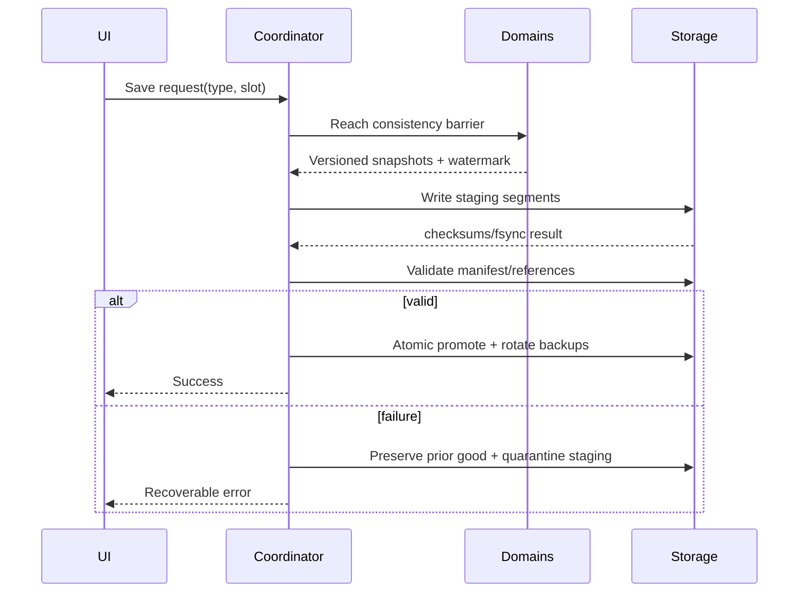
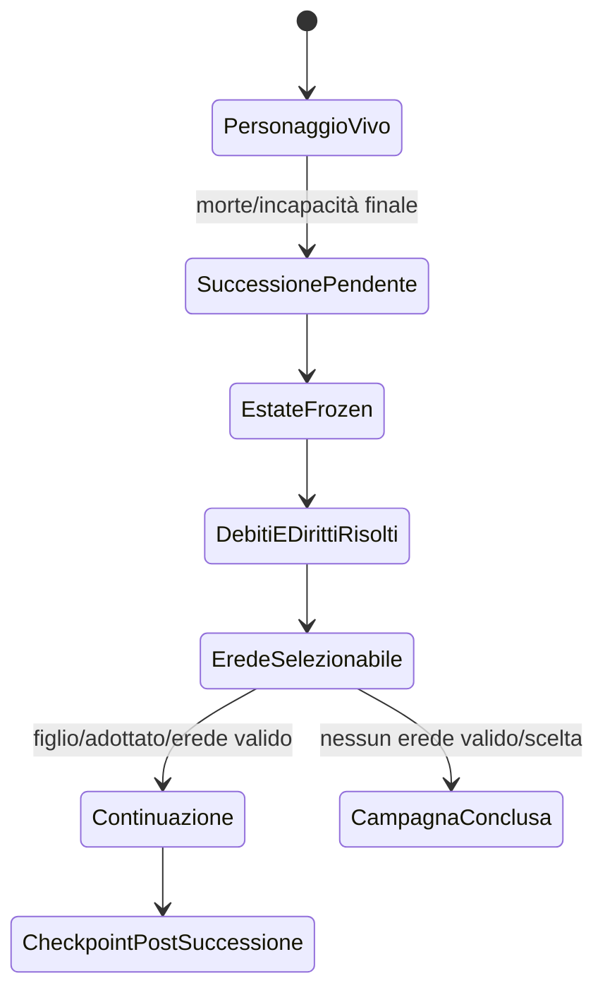

# Architettura del sistema di salvataggio

## Scopo

Definire salvataggi manuali/autosave versionati, atomici, recuperabili e compatibili con un mondo persistente multi-risoluzione e successione dinastica.

## Descrizione

Il save è un manifest più snapshot per domini/partizioni e journal selettivo. Non serializza il grafo degli Actor UE: interroga ogni authority tramite DTO versionati durante una barriera coerente, scrive in staging, valida e committa atomicamente.

## Ambito

Manuale, automatico, checkpoint, versionamento, migrazione, compatibilità, corruzione/recovery, stato globale/città/NPC/population aggregates/eventi, eredità, successione e continuazione con figlio.

## Composizione del salvataggio

| Segmento | Contenuto |
|---|---|
| Manifest | save ID, build/ruleset, schema set, world time, player/heir, checksums, segments |
| Global | clock, scheduler, identity registry, global events, campaign metadata |
| City/Region | world state, buildings, markets, institutions, population aggregates, event fronts |
| Entity Critical | player, household, NPC P0, contracts, rights, cases, injuries, inventories |
| Aggregate | N/E/M/W snapshots, distributions, balances, exceptions, seeds |
| Journal | eventi dopo checkpoint, causality e transaction markers necessari al recovery |
| Presentation Profile | accessibilità, input, UI/audio preferences, separabile dalla campagna |

## Flusso di scrittura

La barriera non blocca il mondo per un tempo indefinito: domini completano transazione corrente, marcano watermark e riprendono; copy-on-write/snapshot incremental sono candidati dopo benchmark.

## Salvataggio manuale

Richiesto dal giocatore su slot nominato con conferma di sovrascrittura e spazio. Può essere rifiutato temporaneamente durante transazione non interrompibile, migration o shutdown; UI spiega e riprova. Policy “ironman” non è requisito. Numero slot e cloud sono decisioni piattaforma.

## Autosave e checkpoint

Trigger: intervallo world/real controllato, ingresso/uscita area, riposo, evento/missione significativa, prima di rischio, successione e shutdown sicuro. Debounce/coalescenza, cooldown, rotazione generazionale e budget I/O. Checkpoint tecnico non è necessariamente slot visibile; mai sovrascrivere tutte le copie buone con lo stesso stato corrotto.

## Versionamento, migrazione e compatibilità

Versioni separate: container format, schema per dominio, ruleset/content manifest e build. Loader: legge manifest → verifica compatibilità → copia in workspace → migrazioni ordinate/idempotenti → validation/reconciliation → nuovo save; originale immutato. Support window definita per milestone, non “tutti i save per sempre”. Downgrade non supportato salvo decisione esplicita.

## Corruzione e recovery

Checksum per segmento e manifest, commit marker, backup generazionali, last-known-good e quarantena. Recovery prova: copia primaria → journal replay → backup precedente → caricamento parziale solo se dominio dichiara fallback sicuro. Dati critici mancanti (identity, player, ownership) bloccano caricamento user-safe; cache/viste possono essere ricostruite.

## Stato globale, città e NPC

Partizionamento consente lazy load di città remote, ma manifest conosce versioni/watermark. NPC P0 e record critici individuali; population aggregate conserva distribuzioni, conteggi e exception IDs. Eventi in corso salvano fase, fronti, seed, impatti e responses. Streaming non determina inclusione: record unloaded sono salvati dall'authority.

## Eredità e successione

La successione è transazione di domini Family/Property/Obligation/Identity/Player: congela l'asse, risolve debiti/titoli secondo regole, verifica eredi e cambia player-controlled identity senza sostituire il mondo. Figlio conserva propria biografia, conoscenze e status; non eredita automaticamente competenze/reputazioni/inventario personale.

## Performance e UX

Target iniziali nel budget: autosave senza hitch percepibile critico, progress per operazioni lunghe, cancellazione solo prima del commit, errore chiaro e slot metadata rapido. Compressione/chunking async candidati; memoria di picco e disco misurati su worst-case.

## Casi limite

Disco pieno, permesso negato, crash a ogni fase, save durante event storm/combat, asset mancante, city schema vecchio, duplicate ID, heir morto nello stesso tick, successione con debito contestato, clock mismatch e partial cloud conflict. Nessuna riparazione silenziosa di fatti critici.

## Sicurezza e privacy

Save locale non è confine anti-cheat per single-player, ma input non fidato: bounds, schema e reference validation prima dell'uso. Niente dati personali/telemetria non necessaria. Cifratura/signing solo con requisito/piattaforma, non security theater.

## Dipendenze

- [Formato](save-format.md)
- [Migrazione](migration.md)
- [Recovery](corruption-recovery.md)
- [World state](world-state.md)
- [Successione](succession-saves.md)

## Collegamenti agli altri documenti

- [Architettura dati](../data/data-architecture.md)
- [Schema catalog](../data/domain-schema-catalog.md)
- [Event architecture](../architecture/event-architecture.md)
- [Save budget](../performance/save-load-budget.md)

## Test e Definition of Done

Golden saves per versione, fault injection ogni fase, corruption matrix, migration, compatibility, global/city/entity/aggregate, event-in-progress, manual/autosave, successione, disk full e load benchmark. S4 con formato, support policy, atomicity, recovery e budget approvati.

## Decisioni ancora aperte

- Formato fisico, compressione, support window e slot/backup count.
- Cloud save e conflitti solo dopo target piattaforme.

## TODO

- Creare manifest/schema registry P0 e golden-save plan.
- Chiudere Q-239–Q-242.
