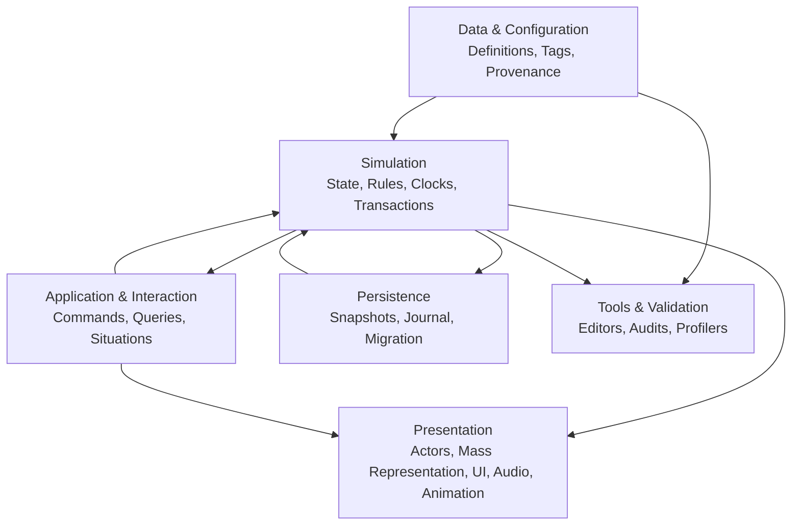
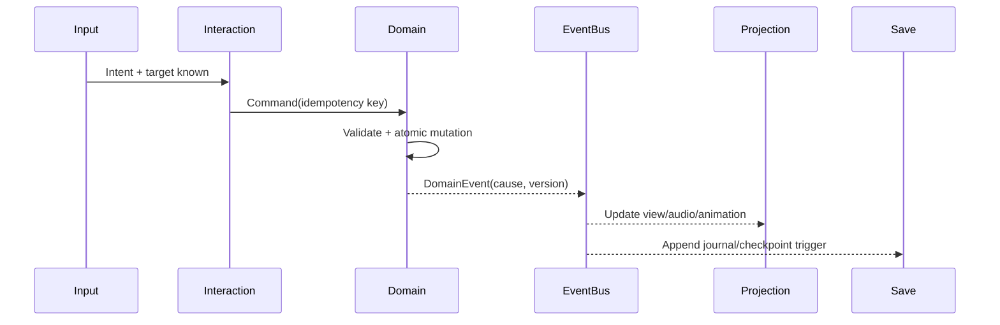

# Architettura tecnica Unreal Engine 5

## Scopo

Tradurre la Game Bible in un'architettura UE5 modulare, testabile e scalabile, senza autorizzare codice, Blueprint o asset.

## Descrizione

Il runtime è organizzato in quattro piani: dati/configurazione, simulazione autoritativa, interazione/orchestrazione e presentazione. Lo streaming grafico non possiede lo stato del mondo; le entità persistenti sopravvivono alla rappresentazione Actor/Mass/aggregata.

## Ambito

Struttura progetto, moduli/plugin, C++/Blueprint, dati, tag, componenti/subsystem, eventi, AI, Mass, mondo/streaming, navigazione, animazione, interazione, inventario, contenuti, economia, tempo, combattimento, save, localizzazione, audio, UI, convenzioni, test e performance.

## Driver e requisiti non funzionali

- Identità persistenti e salvataggi versionabili.
- Simulazione multi-risoluzione indipendente dagli Actor caricati.
- Pompei densa con streaming e folle budgetizzate.
- Causal trace, determinismo diagnostico e recovery.
- Authoring data-driven con validazione storica.
- Estensione a città/province senza dipendenze circolari.
- Test headless dei domini e test funzionali UE mirati.
- Nessuna dipendenza sperimentale nel core senza ADR, benchmark e fallback.

## Piani e autorità

### Regole di dipendenza

1. Presentazione legge view model e invia intenti; non muta domini.
2. Interazione valida affordance e invia comandi; non possiede inventario/quest.
3. Simulazione possiede stato corrente e invarianti per dominio.
4. Dati definiscono tipi e parametri read-only; non contengono stato di partita.
5. Persistenza serializza contratti espliciti, non grafi UObject arbitrari.
6. Moduli dominio non dipendono da UI, mappe concrete o contenuto Pompei.
7. Comunicazione cross-domain via command/query/event contract, mai cast a implementazioni.

## Topologia runtime

| Lifetime UE | Responsabilità | Esempi |
|---|---|---|
| Engine/processo | servizi senza stato campagna | schema/version registry, build metadata |
| `UGameInstanceSubsystem` | sessione, profilo, save coordinator, cataloghi | bootstrap, localization profile |
| `UWorldSubsystem` | simulazione del mondo corrente | tempo, scheduler, eventi, streaming bridge |
| `ULocalPlayerSubsystem` | preferenze/view model per giocatore locale | input context, accessibilità, UI state |
| Actor/Component | presenza spaziale/interazione caricata | avatar, interactable proxy, audio source |
| Mass Entity | rappresentazione data-oriented transitoria | folle e agenti a LOD validati |
| Domain record | stato persistente indipendente da UE Actor | persona, proprietà, contratto, edificio |

## Flusso comando-evento-presentazione

## Strategia UE5

- **C++:** invarianti, modelli persistenti, transazioni, scheduler, serialization, API, processori Mass, performance-critical e test.
- **Blueprint:** assemblaggio/presentazione, animazione/UI, prototipi e logica locale bounded; niente stato canonico o loop massivi.
- **Data Assets:** definizioni identitarie/gerarchiche e riferimenti soft; Primary Data Asset per caricamento Asset Manager.
- **Data Tables/Data Registries:** dataset tabellari read-only omogenei e patchabili; mai stato runtime.
- **Gameplay Tags:** vocabolario gerarchico governato per capacità, stato e classificazione; non ID entità né sostituto di schema.
- **StateTree:** logica gerarchica data-driven degli agenti/attività e integrazione Mass candidata.
- **Behavior Tree:** comportamento tattico Actor-centric dove Blackboard/servizi sono adeguati; non simulazione sociale globale.
- **MassEntity:** folla/agent representation e calcoli batch solo dopo benchmark; domain record resta autoritativo.
- **World Partition:** streaming di Pompei con OFPA, Data Layers e HLOD; caricamento non equivale a esistenza.

## Qualità, errori e osservabilità

Risultati tipizzati (`Success`, `Rejected`, `Retryable`, `Corrupt`), assert solo per invarianti di sviluppo, errori recuperabili senza crash, correlation/causation ID, categorie log per dominio, rate limit e redazione dati. Inspector di entità, event trace, scheduler, LOD e ownership richiesti prima della scala.

## Performance e scalabilità

Budget per clock/LOD; lavoro event-driven e a intervalli; allocazioni ridotte nei loop; query batch; streaming asincrono; soft references; cache con invalidazione esplicita. Nessuna ottimizzazione senza benchmark, ma nessun sistema S4 senza percorso di profilazione e degradazione.

## Sicurezza e manutenibilità

Plugin terzi minimizzati, versioni approvate, scansione licenze/dipendenze, configurazioni validate. API pubbliche strette, versionamento schema/eventi, ADR per nuove dipendenze, owner per moduli e documentazione “change impact”.

## Dipendenze

- [Principi architetturali](architecture/architecture-principles.md)
- [Confini](architecture/domain-boundaries.md)
- [Mappa sistemi UE5](unreal-engine-5/system-implementation-map.md)
- [Moduli](unreal-engine-5/modules.md)
- [Dati](data/data-architecture.md)

## Collegamenti agli altri documenti

- [Eventi](architecture/event-architecture.md)
- [Save](save-system/save-architecture.md)
- [Performance](performance/performance-strategy.md)
- [Testing](../11-production/testing/README.md)
- [Fonti UE5](unreal-engine-5/official-sources.md)

## Test e Definition of Done

Architecture fitness tests per dipendenze, ownership, eventi, serialization e naming; test dominio headless, integrazione, funzionali UE, soak e benchmark. S4 quando ogni sistema P0 ha modulo, autorità, API, dati, LOD, failure policy, test e budget; nessun blocco UE sperimentale irrisolto.

## Decisioni ancora aperte

- Versione UE5 baseline e piattaforme target.
- Adozione finale Mass/StateTree/navmesh partizionata dopo spike autorizzati.
- Confini esatti dei moduli P0 rispetto ai tempi di build/team.

## TODO

- Chiudere Q-229–Q-234 e ADR tecnici.
- Eseguire review Architecture, Gameplay, AI, Data, Build, QA e Security prima del Prompt 16.
