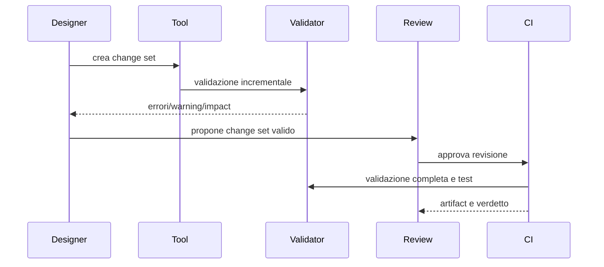

# Contratti degli strumenti per i designer

**ID:** TECH-TOOLS-CONTRACTS
**Stato:** S3 — contratti logici, implementazione non autorizzata

## Scopo

Specificare responsabilità, input, output e gate dei tool necessari alla vertical slice di Pompei.

## Descrizione

Questa matrice evita che editor differenti reimplementino regole di dominio. La [strategia degli strumenti](tools-strategy.md) governa la shell e il ciclo editoriale; le specifiche specializzate governano l'esperienza del singolo tool.

## Ambito

Tool P0 di authoring, validazione, generazione, debugging, telemetria, profiling e test automatici. Nessun codice o scelta tecnologica.

## Matrice dei contratti

| Tool | Legge | Produce | Validazioni specifiche | Recovery/Test |
|---|---|---|---|---|
| Event editor | calendario, luogo, condizioni, domini | definition + grafo conseguenze | cicli, cooldown, D0–D5, aftermath | replay seed e scenari limite |
| Dialogue editor | persona, conoscenza, relazione, lingua | nodi, utterance, loc/audio refs | raggiungibilità, fonte, fallback | traversal completo e missing media |
| Situation/quest editor | eventi, obblighi, fatti conosciuti | situation binding e outcome | nessun ownership duplicato, scadenze | simulazione esito/fallimento |
| Economy editor | beni, lotti, rotte, imprese, shock | profili mercato e scenari | conservazione, prezzi finiti, capacità | time-lapse e regression envelope |
| Historical validator | claim, fonte, periodo, area | report A–E e waiver | fonte non inventata, scope compatibile | corpus golden revisionato |
| Data validator | schema registry e manifest | diagnostiche e impact graph | ID, tipo, refs, ownership, versione | fuzz e dataset corrotti |
| NPC generator | coorti, nomi, famiglie, professioni | record candidati + seed | distribuzioni, legami, capacità/status | replay e statistical acceptance |
| Simulation debugger | save/snapshot, event journal, tiers | trace causale e repro package | authority leaks, divergenze tier | step/replay e checksum |
| Local telemetry | metric catalog e privacy policy | serie temporali e report | allowlist, quota, retention | cancellazione e disk-pressure |
| Profiler | build, scenario e budget | capture e confronto baseline | scenario/hardware/versione presenti | regression gate |
| Automated test harness | dataset, seed, oracle | risultati, artifact e trend | isolamento e ripetibilità | retry diagnostico, non occultante |

## Flusso di pubblicazione

## Dati ed eventi

I tool leggono viste versionate e producono change set; non emettono eventi runtime canonici. Preview e debugger possono inviare comandi a una sandbox e ricevere `DiagnosticRaised`, `ValidationCompleted`, `ScenarioCompleted`, `BudgetExceeded` e `ReproPackageCreated`. Gli eventi diagnostici non entrano nel save di gioco.

## Casi limite

- Due autori modificano lo stesso ID: merge semantico oppure conflitto esplicito, mai last-write-wins silenzioso.
- Lo schema cambia durante un draft: migrazione in copia e diff prima dell'accettazione.
- Il generatore non soddisfa vincoli: fallisce con report del vincolo minimo incompatibile.
- Una preview diverge dal runtime: blocco publish e registrazione di versione/configurazione.
- Dataset storico incompleto: classe E e publish bloccato salvo licenza D approvata.

## Dipendenze

- [Catalogo schema](../data/domain-schema-catalog.md)
- [Strategia strumenti](tools-strategy.md)
- [Pipeline](../pipelines/pipeline-overview.md)
- [Framework storico](../../02-historical-foundation/historical-framework.md)

## Collegamenti agli altri documenti

- [Editor eventi](event-editor.md)
- [Editor dialoghi](dialogue-editor.md)
- [Editor missioni](quest-editor.md)
- [Editor economico](economy-editor.md)
- [Generatore NPC](npc-generator.md)
- [Validatore storico](historical-validator.md)
- [Validatore dati](data-validator.md)

## Decisioni ancora aperte

- Confine tra tool integrati nell'Unreal Editor e applicazioni esterne.
- Formato dei change set e strategia di merge semantico.
- Soglie statistiche per la generazione NPC.

## Criteri di completamento

Ogni riga ha specifica UX, schema, codici errore, dataset golden, owner, benchmark e criterio di release approvati.

## TODO

- Assegnare owner e milestone.
- Produrre wireframe e test di usabilità.
- Definire il catalogo canonico delle metriche.
