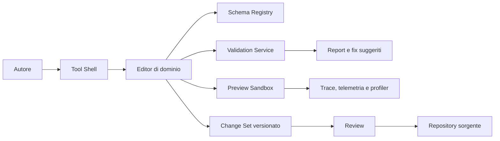
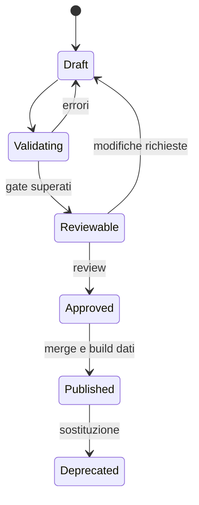

# Strategia degli strumenti interni

**ID:** TECH-TOOLS-STRATEGY
**Stato:** S3 — specifica integrata, tecnologie e owner da approvare

## Scopo

Definire la piattaforma di authoring, validazione e osservabilità che consente a designer, storici, narrative designer, economy designer e QA di modificare e verificare *Roma Aeterna* senza dipendere da interventi manuali di engineering.

## Descrizione

Gli strumenti sono prodotti interni con contratti, test, telemetria e ownership propri. Non possiedono lo stato runtime: producono definizioni versionate, inviano comandi validati agli ambienti di simulazione e leggono viste diagnostiche. Ogni modifica deve essere confrontabile, annullabile e attribuibile.

## Ambito

Include shell comune, editor di eventi, dialoghi, missioni ed economia, validatori, generazione NPC, debugger, telemetria locale, profiling e harness di test. Sono esclusi codice, UI esecutive, scelta del framework editor e servizi cloud.

## Utenti e risultati attesi

| Ruolo | Bisogno | Risultato verificabile |
|---|---|---|
| System/economy designer | configurare regole e scenari | diff semantico, simulazione e report invarianti |
| Narrative designer | costruire situazioni e dialoghi | grafo raggiungibile, fonti informative esplicite |
| World designer | associare contenuti a luoghi | riferimenti stabili e nessun hard reference vietato |
| Storico/linguista | verificare claim e lessico | provenienza A–E, periodo e area obbligatori |
| QA | riprodurre e minimizzare difetti | seed, trace causale e snapshot esportabile |
| Technical artist/engineer | misurare costo e dipendenze | budget, asset residency e regressioni visibili |

## Principi e vincoli

1. **Un solo schema:** editor e runtime consumano il medesimo registro di tipi, ID, enum e vincoli.
2. **Nessuna mutazione laterale:** un tool non scrive direttamente nello store di un altro dominio.
3. **Anteprima isolata:** preview e simulazioni usano sandbox con seed e tempo dichiarati.
4. **Provenienza:** autore, revisore, timestamp, motivazione e fonti accompagnano ogni change set.
5. **Sicurezza operativa:** undo/redo, autosave della sessione, dry-run, diff e conferma per operazioni massive.
6. **Accessibilità:** tastiera completa, scaling, contrasto, ricerca e messaggi d'errore azionabili.
7. **Determinismo diagnostico:** ogni riproduzione registra versione dati, seed, configurazione e build.

## Architettura logica

La shell fornisce selettore ambiente, ricerca per ID, gestione change set, history, ruoli, diagnostica e collegamenti alla documentazione. Gli editor di dominio aggiungono soltanto viste e operazioni specifiche.

## Contratto comune di authoring

### Input

- definizioni e record conformi al [catalogo degli schemi](../data/domain-schema-catalog.md);
- profilo storico, configurazione, localizzazione e catalogo Gameplay Tags;
- versione base e change set dell'autore;
- scenari, seed e dataset di benchmark.

### Output

- patch semantica leggibile e machine-readable;
- report errori, warning, impatto e copertura;
- artifact di preview non canonici;
- manifest con schema, dipendenze, fonti e firme di revisione.

### Stati

`Approved` non equivale a dato storico certo: la classe A–E resta indipendente dallo stato editoriale.

## Portafoglio P0–P2

| Tool | Priorità | Capacità minima | Gate |
|---|---:|---|---|
| Validatore dati | P0 | schema, riferimenti, invarianti, dipendenze | zero errori bloccanti |
| Debugger simulazione | P0 | pausa, step, trace causale, tier, seed | riproduzione deterministica |
| Editor eventi | P0 | trigger, durata, propagazione, aftermath | grafo finito e budget |
| Editor missioni/situazioni | P0 | impegni, fonti, scadenze, esiti | nessun fatto onnisciente |
| Editor dialoghi | P0 | nodi, condizioni, loc, audio e conoscenza | raggiungibilità e fallback |
| Editor economia | P0 | mercati, filiere, shock, time-lapse | conservazione e stabilità |
| Generatore NPC | P0 | coorti, vincoli, seed e promozione | distribuzioni e referential integrity |
| Validatore storico | P0 | classe A–E, periodo, area, fonte, licenza | nessun claim E pubblicabile |
| Telemetria locale | P0 | metriche, eventi diagnostici, retention | privacy e budget disco |
| Profiler integrato | P0 | CPU/GPU/memoria/streaming per scenario | confronto con baseline |
| World/NPC editor avanzati | P1 | authoring spaziale e biografico | milestone dedicata |
| Generazione assistita massiva | P2 | proposte, mai publish automatico | review umana obbligatoria |

I contratti operativi sono dettagliati nella [matrice degli strumenti](designer-tool-contracts.md).

## Validazione e gestione degli errori

| Severità | Significato | Comportamento |
|---|---|---|
| Blocker | perdita dati, ID duplicato, violazione etica/storica o invariant | impedisce publish |
| Error | contenuto irraggiungibile o contratto invalido | impedisce approvazione |
| Warning | rischio, costo o incompletezza accettabile motivata | richiede waiver tracciato |
| Info | suggerimento o metrica | non blocca |

Ogni diagnostica contiene codice stabile, percorso dell'elemento, spiegazione, prova, fix suggerito non distruttivo e link alla regola. Le correzioni massive producono sempre una preview e una patch reversibile.

## Persistenza, sicurezza e privacy

- I draft locali sono separati dagli asset canonici e recuperabili dopo crash.
- Token, credenziali e dati personali non entrano in log, trace o change set.
- La telemetria è locale per impostazione corrente, con categorie allowlist, retention e cancellazione esplicite.
- Export diagnostici rimuovono percorsi utente e identificatori non necessari.
- Il generatore NPC non crea stereotipi moderni da attributi protetti; usa vincoli storici documentati e review distributiva.

## Prestazioni e scalabilità

- interazione ordinaria: risposta percepita entro 100 ms; query complesse entro 1 s con progress;
- validazione incrementale sul change set; validazione completa in CI;
- dataset grandi virtualizzati e paginati, mai caricati integralmente per convenienza UI;
- time-lapse e generatori eseguibili in batch con cancellazione, seed e limiti risorse;
- trace con sampling e ring buffer per rispettare i [budget prestazionali](../performance/performance-strategy.md).

Le soglie sono target D iniziali e richiedono benchmark sull'hardware approvato.

## Strategia di test

- unit test delle regole di validazione e delle migrazioni di contenuto;
- golden dataset per dialoghi, eventi, prezzi, famiglie e cronologie;
- property-based test per ID, conservazione economica e aggregazione;
- fuzz di import, riferimenti mancanti, cicli e file troncati;
- test undo/redo, crash recovery e concorrenza tra change set;
- test UX con ciascun ruolo e misure time-to-author/time-to-diagnose;
- benchmark incrementale/completo e soak delle simulazioni accelerate.

## Dipendenze

- [Architettura dati](../data/data-architecture.md)
- [Architettura di salvataggio](../save-system/save-architecture.md)
- [Architettura tecnica](../technical-architecture.md)
- [Pipeline](../pipelines/pipeline-overview.md)
- [Testing](../../11-production/testing/README.md)

## Collegamenti agli altri documenti

- [Debugger della simulazione](simulation-debugger.md)
- [Telemetria locale](local-telemetry.md)
- [Profilazione](profiling.md)
- [Registro decisioni](../../00-governance/decision-log.md)
- [Registro rischi](../../11-production/risk-register.md)

## Rischi

- Tooling tardivo trasforma engineering in collo di bottiglia.
- Schemi duplicati causano divergenza editor/runtime.
- Generazione non supervisionata produce popolazioni incoerenti o rappresentazioni dannose.
- Trace illimitati saturano disco e alterano i benchmark.
- Un editor troppo generico nasconde concetti di dominio e aumenta gli errori.

## Criteri di accettazione

- Ogni tool P0 ha owner, personas, schema, input/output, errori, recovery e test.
- Un change set attraversa draft, validazione, review e publish senza editing manuale di artifact generati.
- È possibile riprodurre un difetto da seed, build, configurazione e trace.
- I validator bloccano riferimenti rotti, invarianti e claim storici incompleti.
- Telemetria e profiling rispettano retention, privacy e budget.

## Definition of Done

La strategia raggiunge S4 quando tecnologie, owner, UX prototype, dataset campione, benchmark e criteri privacy sono approvati; i tool P0 hanno specifiche testabili e backlog; pipeline e CI applicano gli stessi validator. Questo documento non autorizza implementazione.

## Decisioni ancora aperte

- Framework della shell e grado di integrazione con Unreal Editor.
- Owner e staffing per ciascun tool P0.
- Retention, formato ed export della telemetria locale.
- Dataset e soglie definitive per benchmark di authoring.

## TODO

- Prototipare i workflow con utenti rappresentativi.
- Approvare codici diagnostici e policy dei waiver.
- Collegare ogni editor al registry fisico degli schemi quando scelto.
