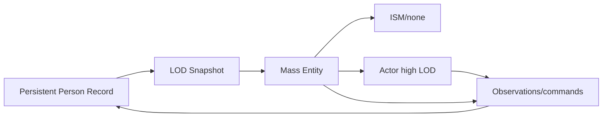

# Mass Entity e rappresentazione delle folle

## Scopo

Valutare e governare MassEntity/MassGameplay per calcoli e rappresentazioni numerose senza rendere Mass l'autorità delle persone persistenti.

## Descrizione

Mass usa entità composte da frammenti data-only e processori batch. In Roma Aeterna è adapter/projection per N0–N3 e folle; il `PersonRecord` persistente resta nel dominio Population.

## Ambito

Entity/template/trait/fragment/tag/processor, signals, StateTree, representation LOD, Smart Object integration candidata, sincronizzazione Actor↔Mass↔aggregato.

## Ownership

`FRAEntityId` collega Mass handle transitorio a record stabile. Fragments contengono solo dati necessari al batch corrente: transform, velocity, LOD, intent summary, representation, schedule slice. Relazioni, debiti, memoria, salute completa e inventari restano repository dominio.

## Regole di sincronizzazione

Promozione crea snapshot, riserva identity ownership, costruisce entity/Actor, verifica e committa. Degradazione raccoglie output autorizzati, riconcilia e distrugge projection. Un solo writer per campo; MassCommandBuffer per composition change; segnali svegliano lavoro. Handle Mass mai nei save.

## Gate e fallback

Benchmark contro soluzione Actor/aggregata per densità Pompei, CPU, memoria, spawn, representation switch, path/avoidance e authoring. Se fallisce, usare coorti/flow fields e Actor pool; nessun sistema core dipende soltanto da Mass. Plugin/stato UE verificati per baseline.

## Test e casi limite

Entity senza record, handle riciclato, doppia promotion, Actor unload, processor order, save durante swap e città scaricata richiedono reconciliation/rollback. Test conservation N0–N5, determinism, soak folla, teardown world e leak.

## Dipendenze

- [NPC levels](../../04-simulation/npc-population-ai/simulation-levels.md)
- [StateTree/BT](state-tree-behavior-tree.md)
- [Navigation](navigation-crowds.md)
- [Fonti UE5](official-sources.md)

## Collegamenti agli altri documenti

- [Mappa sistemi](system-implementation-map.md)
- [Crowd budget](../performance/npc-crowd-budget.md)
- [Save](../save-system/save-architecture.md)

## Definition of Done

Spike approvato, schema fragments minimo, ownership/sync/fallback, budget e test definiti; nessun handle o fragment Mass è stato persistente o autorità sociale.

## Decisioni ancora aperte

- Adozione P0 e plugin MassGameplay/StateTree/SmartObjects.
- Representation LOD e dimensioni chunk/query.

## TODO

- Scrivere piano benchmark, non implementarlo.
- Mappare fragments/projections P0.
