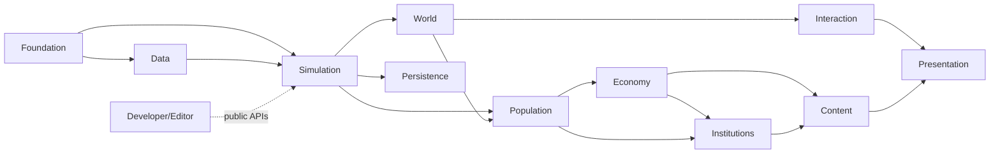

# Moduli e plugin first-party

## Scopo

Assegnare responsabilità, API, dipendenze consentite e caricamento ai confini software.

## Descrizione

I moduli sono unità di compilazione/deployment; i plugin raggruppano capability coerenti con runtime/editor/test separati. Il numero finale è calibrato sui tempi di build, ma i confini logici restano obbligatori.

## Ambito

Moduli runtime, editor e developer; dependency direction, API, ownership e strategia di caricamento.

## Catalogo logico

| Modulo logico | Possiede | Dipende da | Non può dipendere da |
|---|---|---|---|
| Foundation | ID, result, clock contract, schema primitives | Core UE | contenuti/presentation |
| Data | definitions, registries, validation/provenance | Foundation, Asset Manager | stato runtime UI |
| Simulation | scheduler, command/query/event, LOD | Foundation, Data | Actor concreti |
| World | luoghi, edifici, streaming bridge, nav contracts | Foundation, Simulation | Pompei content |
| Population | persona, AI, memoria, relazioni, Mass bridge | Simulation, World | UI/audio concreti |
| Economy | beni, proprietà, lavoro, mercati, contratti economici | Simulation, Population | quest/UI |
| Institutions | status, diritto, politica, religione, militare | Simulation, Population, Economy | presentation |
| Content | situazioni, dialoghi, eventi, narrative projection | domain public APIs | mutazioni dirette |
| Interaction | affordance, intent, target, command adapter | public domain APIs | dominio privato |
| Combat | contatto, trauma, morale integration | Simulation, Population, Items | UI concreta |
| Persistence | snapshot, journal, migration, recovery | versioned contracts | UObject graph arbitrario |
| Presentation | Actors, animation, UI, audio, localization | public queries/events | scrittura dominio |
| Developer/Editor | validator, inspector, authoring, benchmark | tutte API pubbliche | shipping runtime obbligatorio |

## Grafo consentito

Le frecce indicano dipendenza; Presentation non ritorna verso domini. Eventi non giustificano dipendenze circolari: i contratti condivisi vivono nel provider o Foundation solo se veramente trasversali.

## API e visibilità

Header/API pubbliche minime; tipi privati non attraversano moduli. Comandi con ID idempotenza e caller authority; query read-only; eventi versionati, immutabili e causali. Nessun singleton globale non governato, `GetAllActorsOfClass` sistemico o cast cross-plugin.

## Runtime, Editor e Developer

Ogni plugin può avere moduli `Runtime`, `Editor`, `Developer`, `Tests`. Runtime non include editor headers. Tooling opzionale non diventa requisito shipping. Startup esplicito, shutdown idempotente, world teardown e PIE multi-world testati.

## Plugin UE valutati

| Tecnologia | Stato architetturale | Gate |
|---|---|---|
| GameplayTags, Enhanced Input, UMG/CommonUI candidate | approvabile P0 | piattaforme/UX |
| StateTree, Smart Objects | candidato P0 | spike AI/interaction |
| MassEntity/MassGameplay | candidato condizionale | benchmark folla + fallback |
| World Partition/OFPA/Data Layers/HLOD | baseline mondo | benchmark streaming/source control |
| Data Registry | candidato dataset read-only | confronto Asset Manager/Data Table |
| World Partition Navmesh | non core finché sperimentale | ADR/versione UE + fallback nav |

## Errori, test e manutenibilità

Dependency fitness test, include-what-you-use, build moduli isolati, startup/shutdown, packaging senza Editor e API compatibility. Violazione confini fallisce CI. Split/merge modulo richiede ADR con costo build, ownership e migrazione.

## Dipendenze

- [Architettura](../technical-architecture.md)
- [Plugin](plugins.md)
- [Confini domini](../architecture/domain-boundaries.md)
- [Eventi](../architecture/event-architecture.md)

## Collegamenti agli altri documenti

- [Struttura](project-structure.md)
- [Componenti/subsystem](components-subsystems.md)
- [Mappa sistemi](system-implementation-map.md)
- [Testing](../../11-production/testing/README.md)

## Definition of Done

Ogni sistema P0 mappato a un owner/modulo; grafo aciclico; API/failure/lifetime documentati; runtime/editor separati; tecnologie condizionali hanno benchmark e fallback.

## Decisioni ancora aperte

- Packaging effettivo dei moduli logici nei plugin.
- CommonUI/DataRegistry/Mass/Smart Objects finali dopo spike.

## TODO

- Generare futura dependency allowlist per CI.
- Assegnare ownership nominale.
