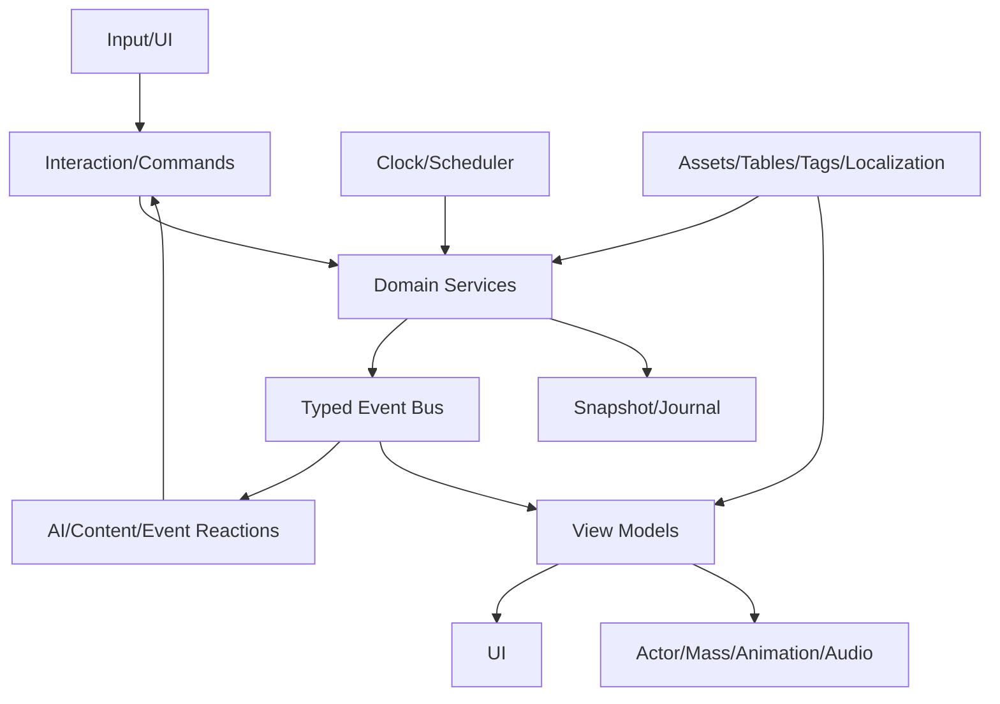

# Contratti tecnici dei sistemi runtime

## Scopo

Dettagliare la traduzione dei sistemi Game Bible in servizi software, API e adapter UE5 senza definire codice concreto.

## Descrizione

Ogni sistema possiede dati e invarianti, riceve comandi/query/eventi, pubblica eventi e offre proiezioni. Le sezioni seguenti sono contratti di responsabilità; firme e payload puntuali saranno versionati prima dell'implementazione.

## Ambito

Interazione, inventario, quest, dialogo, economia, AI, calendario, eventi, combattimento, salvataggio, localizzazione, audio, UI e animazione.

## Contratto comune

| Aspetto | Regola |
|---|---|
| identity | stable `FRAEntityId`/definition ID, mai pointer persistente |
| command | intento, caller authority, idempotency key, expected version |
| query | read-only, snapshot/version, knowledge filter quando applicabile |
| event | passato, producer, world time, correlation/causation, schema version |
| error | typed result: rejected/retryable/degraded/corrupt |
| save | schema record + migration; asset salvato per ID/versione |
| LOD | promozione/degradazione conserva invarianti e journal |

## Interazione

Possiede sessione transitoria di interazione, reservation e stato di contesa; legge affordance da target/profilo persona/mondo. Riceve `Begin/Commit/CancelInteraction`; produce `InteractionStarted/Committed/Interrupted`. Actor Component e interface espongono proxy; `UWorldSubsystem` coordina target/reservation. Lontano: nessun proxy, ma impegni già committati continuano nel dominio. Test: target unload, doppio uso, perdita capacità, cancellation, multiplayer futuro non attivo.

## Inventario, oggetti e proprietà

Inventory domain possiede contenitori, slot/capacità, lotti e custodia; Property possiede diritti. Componenti Actor sono viste. Comandi move/split/merge/use/equip verificano quantità, accesso e transazione; eventi `LotMoved`, `ContainerChanged`, `ItemConsumed`. Lontano: record completo per P0, aggregato conservativo altrove. Save serializza IDs/lotti/stato, non componenti. Test duplicazione, rollback, contenitore scaricato e ownership conflict.

## Situazioni e missioni

Content service possiede definition binding, instance state, lead e commitment; non possiede ricompense/domains. Data/Primary Assets definiscono situation/storylet; subsystem event-driven valuta transizioni. UI journal è projection epistemica. Lontano: scadenze/mutazioni via eventi; definition caricata su richiesta. Test morte attore, luogo distrutto, falso lead, time-skip e schema migration.

## Dialogo

Dialogue service possiede conversation session, turn, participants, known facts exposed, choices/utterance IDs e outcome requests. Assets/String Tables contengono graph/line metadata; localizzazione/voice risolvono per key. StateTree/dialogue graph candidato solo per presentazione del flusso, non memoria NPC. Eventi `ConversationStarted`, `UtteranceDelivered`, `ConversationEnded`; comandi dominio separati. Test lingua switch, speaker unload, interrupzione, knowledge leak e subtitle-only.

## Economia

Economy modules possiedono goods, ledger, enterprise, market e price observations; subsystem/scheduler esegue E0–E5. Data Tables/Assets per good/recipe/unit definitions. Nessun Actor o quest scrive saldo. UI query filtrata per mercato/data conosciuti. Eventi `TransactionCommitted`, `PriceObserved`, `ShortageDeclared`. Test conservation, interval equivalence, async asset missing, save and reconciliation.

## NPC, AI e folle

Population possiede person record, knowledge, needs, commitments e relationships. Decision service crea intenti; StateTree candidato per attività, BT per tattica, Mass per batch/projection. Actor/Mass handle transitori. N0–N5 definiscono frequenza; signal/event wake-up. Eventi `IntentSelected`, `ActivityStarted/Ended`, `LODChanged`. Test determinismo, no omniscience, cancellation, planner stall, Actor↔Mass↔aggregate e world teardown.

## Tempo, calendario ed eventi

World clock è autorità del tempo simulato; scheduler possiede scadenze; Dynamic Event domain possiede processi D0–D5. `UWorldSubsystem` coordina budget, non frame time come data canonica. Comandi pause/rate/advance controllati; eventi `WorldTimeAdvanced`, `DeadlineReached`, `DynamicEventPhaseChanged`. Lontano: milestone/intervalli; grandi processi continuano. Test ordinamento, time-skip, back-pressure, same-time events, save/resume e calendar ruleset.

## Combattimento e salute

Combat domain possiede engagement, intent resolution e contact causal record; Person/Health possiede lesioni e capacità. Actor components raccolgono input/contatto e proiettano animazione/audio. State machine di dominio per engagement/ferite; BT solo tattica. M0 completo, M1/M2 aggregato; nessun combattimento lontano ricostruisce persone P0 senza ledger. Test hit geometry, idempotency, surrender, trauma, animation mismatch, save policy e LOD.

## Save e caricamento

Save coordinator `GameInstance` orchestra freeze barrier logica, snapshot per dominio, journal, manifest, checksum, atomic write, recovery e migration. Ogni dominio serializza DTO/versione tramite propria API. World Partition/Actor non sono source of truth. Async operation espone progress/cancel policy; autosave rispetta transazioni critiche. Test crash/fault injection, partial write, old schema, missing asset, successione, huge world e determinism.

## Localizzazione

Localization adapter risolve text key, culture, grammatical/context metadata e fallback. UI/dialogue non hard-code testo. String Tables/Localization Dashboard candidati; asset audio voice ha culture/variant e fallback subtitle. Termini latini, italiano e registri hanno bible linguistica/provenance. Test pseudo-localization, expansion, glyph/font, plural/context, runtime culture switch, missing key e cook.

## Audio

Audio presentation consuma semantic audio events e world queries; non legge segreti. Components/MetaSounds candidati, soundscape/crowd virtualization e mix subsystem. Eventi best-effort possono essere coalesciati; dialogo/alert critico ha priorità. Persistono preferenze e stato diegetico lungo, non one-shot. Test concurrency, virtualization, repetition, occlusion, language, subtitles, accessibility e budgets.

## UI e input

LocalPlayer subsystem possiede view/navigation/preferences; domain view models sono immutable snapshots/diffs. Enhanced Input e UMG/CommonUI/MVVM sono candidati con adapter. UI invia intent/command e rende typed result; nessuna scrittura diretta. Controller/KBM semantic parity, remapping e focus. Test knowledge leak, device switch, navigation graph, large datasets, notification storm, screen reader hooks e save preferences.

## Animazione

Animation presentation risolve locomotion, action, injury e interaction state da projection; AnimBP/Control Rig/Motion Warping candidati. Notifies non sono autorità del danno: sincronizzano finestre/feedback con resolver. LOD riduce rig/graph/update e può usare Mass representation; lontano nessuna animazione. Test state mismatch, interrupted montage/action, root motion/nav, equipment, injury, crowd LOD e frame budget.

## Diagramma di integrazione

## Dipendenze

- [Mappa sistemi](system-implementation-map.md)
- [Architettura](../technical-architecture.md)
- [Moduli](modules.md)
- [Event contracts](../architecture/event-contracts.md)
- [Save](../save-system/save-architecture.md)

## Collegamenti agli altri documenti

- [Data architecture](../data/data-architecture.md)
- [Performance](../performance/performance-strategy.md)
- [Logging](../architecture/logging-errors.md)
- [Testing](../../11-production/testing/README.md)

## Test e Definition of Done

Per ogni sistema: owner, input/output, dati, eventi, UE adapter, LOD, persistenza, errori, configurazione, performance e test sono mappati; integration scenarios attraversano almeno cinque sistemi senza accesso privato o stato duplicato.

## Decisioni ancora aperte

- Payload/API puntuali e versioni iniziali.
- Tecnologie candidate dopo spike e baseline UE.

## TODO

- Derivare cataloghi command/query/event P0.
- Collegare ogni contratto alla matrice di ownership dati.
