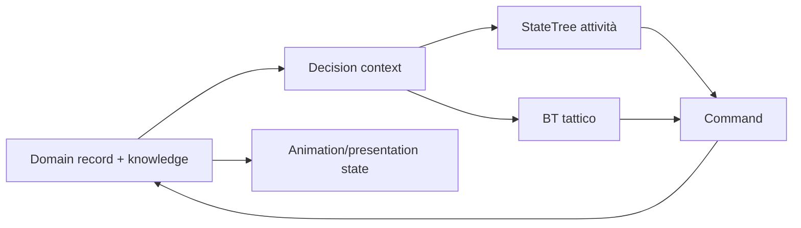

# State machine, StateTree e Behavior Tree

## Scopo

Stabilire quale strumento governa lifecycle, attività sociali e tattiche senza duplicare stato o conoscenza.

## Descrizione

Le macchine a stati di dominio preservano invarianti; StateTree orchestra attività data-driven; Behavior Tree gestisce tattiche reattive Actor-centric. Tutti consumano snapshot/query e inviano comandi.

## Ambito

NPC, routine, interazioni, combattimento, quest adapter, Mass integration, Blackboard/knowledge, wake-up e test.

## Policy

| Strumento | Uso | Non uso |
|---|---|---|
| domain state machine | contratto, ferita, evento, save, lifecycle | presentazione/authoring libero |
| StateTree | attività gerarchiche, routine, fallback, Mass candidate | database persona o tick globale |
| Behavior Tree | combattimento/pattuglia/tattica locale | vita completa, economia o conoscenza globale |
| Anim state machine | locomozione/pose presentation | stato gameplay autoritativo |

Blackboard/context contiene solo facts conosciuti e riferimenti transienti; stable ID per record persistenti. Transition/task ha timeout, cancel, cleanup e failure outcome. Event/signal-driven wake-up preferito al polling.

## Flusso

## Test e performance

Golden traces, task cancellation, timeout, missing target, knowledge leak, save/resume, LOD transition, determinism seed e budget nodes/evaluations. Debugger deve mostrare input, scelta, fallback e comando rifiutato.

## Dipendenze

- [AI NPC](../../04-simulation/npc-population-ai/ai-architecture.md)
- [Mass](mass-entity.md)
- [Event architecture](../architecture/event-architecture.md)

## Collegamenti agli altri documenti

- [Mappa sistemi](system-implementation-map.md)
- [Animazione](animation-system.md)
- [Combattimento](../../04-simulation/military-combat/combat-vision.md)

## Definition of Done

Ogni comportamento P0 sceglie un'autorità/strumento, dichiara context, cancellation, fallback, LOD e test; nessun planner accede a fatti non conosciuti.

## Decisioni ancora aperte

- StateTree/BT split finale dopo spike.
- Authoring e debugging workflow per designer.

## TODO

- Mappare azioni/routine P0.
- Definire benchmark di valutazione.
