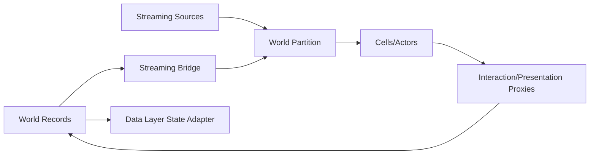

# World Partition, streaming e Data Layers

## Scopo

Definire streaming fisico di Pompei separato dalla persistenza logica del mondo.

## Descrizione

World Partition gestisce celle caricate da streaming source; OFPA supporta collaborazione, Data Layers variazioni/authoring e HLOD rappresentazione distante. Il dominio World decide stato degli edifici e accessi indipendentemente dalla cella.

## Ambito

Persistent map, runtime grid, streaming source, OFPA, Data Layers, HLOD, Level Instance, interni, test map, preload, unload e recovery.

## Architettura

## Regole

- Una runtime grid iniziale preferita; griglie multiple solo benchmark/ADR.
- Player e transizioni previste producono streaming source; prefetch con timeout/fallback.
- Hard Actor references cross-cell vietate; stable ID + soft reference/service resolution.
- `Is Spatially Loaded=false` solo per actor realmente globali e budgetizzati.
- Data Layer non è save system: lo stato canonico decide quale layer/proxy attivare.
- Interni: valutare Level Instance/Data Layer/cella con capienza e occlusione; niente pattern unico prima dei benchmark.
- HLOD solo visuale, nessuna interazione o autorità.

## Stato e failure

`Unloaded → Loading → Loaded → Activated → Deactivating`; slow streaming può degradare velocità/transizione, mostrare feedback o bloccare ingresso controllato, mai teletrasportare senza stato. Actor unload invia snapshot/cleanup; record persistente continua a livelli W/N/E.

## Performance e test

Budget cell size/range/concurrency, I/O, memory, activation hitch, HLOD e actor count. Test percorso PVS-1, corsa/teleport controllato, interno/esterno, save/load in bordo cella, edificio distrutto, Data Layer change, source multipli e package build.

## Dipendenze

- [Mondo](../../03-world/settlements/settlement-framework.md)
- [Project structure](project-structure.md)
- [Performance streaming](../performance/streaming-budget.md)
- [Fonti UE5](official-sources.md)

## Collegamenti agli altri documenti

- [Navigation](navigation-crowds.md)
- [Save world state](../save-system/world-state.md)
- [Pompei area](../../07-pompeii-demo/design/playable-area.md)

## Definition of Done

Grid/source/Data Layer/HLOD/inside policy, stable ID bridge, unload protocol, budgets e benchmark scenes approvati; streaming non cambia lo stato canonico.

## Decisioni ancora aperte

- Cell size/range, HLOD tiers e strategia interni.
- World Partition navmesh se ancora sperimentale nella baseline.

## TODO

- Preparare piano benchmark PVS-1.
- Collegare luoghi P0 a Data Layer e streaming owner.
