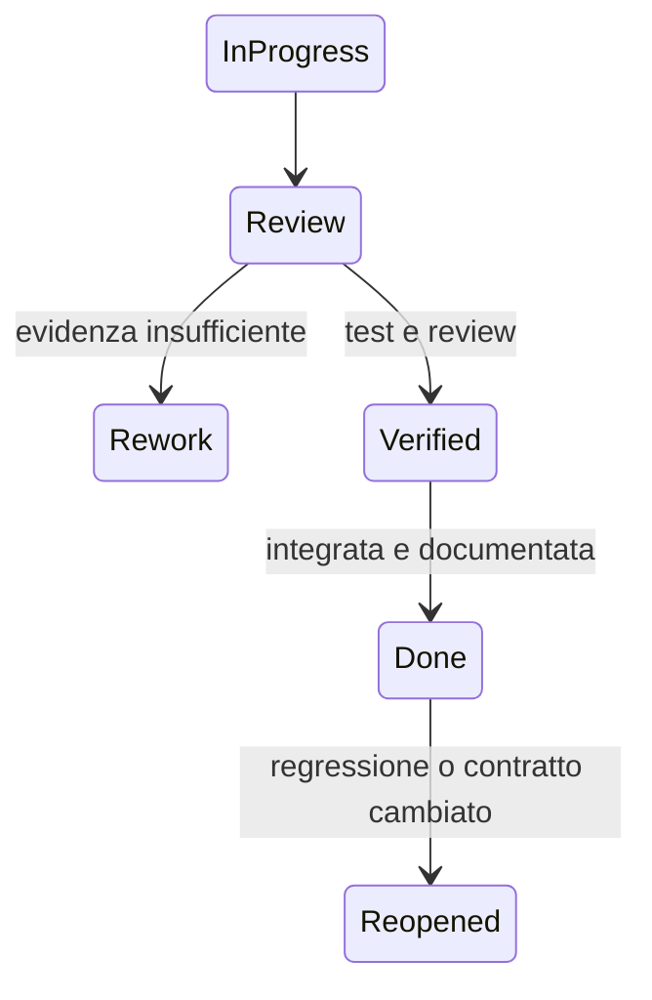

# Definition of Done della vertical slice

**ID:** PRD-DOD-001
**Stato:** S3 — criteri comuni definiti

## Scopo

Definire quando feature, epic, contenuto e milestone sono realmente completati.

## Descrizione

“Funziona sulla macchina dell'autore” o “contenuto inserito” non è Done. L'evidenza deve coprire comportamento, integrazione, qualità, fonti, recovery e documentazione.

## Ambito

Tutto il backlog della demo, inclusi strumenti e pipeline.

## DoD per feature

- requisiti e accettazione P0/P1 superati;
- code/content review da owner appropriati;
- test unitari, contrattuali, integrazione e scenario pertinenti passano in CI;
- errori, fallback, interruzione, save/load e migrazione coperti;
- performance misurata in scenario/versione/hardware dichiarati;
- accessibilità e localizzazione incluse nel flusso, non posticipate;
- dati/fonti/licenze A–E completi e validator senza blocker;
- logging/trace utili e privi di segreti/dati vietati;
- documentazione as-built, dipendenze, backlog, rischi e changelog aggiornati;
- nessun blocker/critical; Major entro cap con owner e milestone;
- artifact riproducibile dal commit pulito.

## DoD per contenuto

ID stabile, owner, stato, luogo/periodo, dipendenze, varianti, fallback, localizzazione, audio/accessibilità, fonti/licenze, budget, test di raggiungibilità e comportamento dopo morte/assenza/scadenza. Contenuti non raggiungibili o duplicati non contano come completati.

## DoD per epic

Tutte le Must Done; Should esplicitamente chiuse o rimosse; golden scenario e failure scenario passano; metriche dell'outcome raggiunte; rischi residui accettati; nessun workaround manuale di engineering necessario al normale authoring.

## DoD per milestone

Entry/exit della [milestone](milestones.md), acceptance disciplinari, artifact, note, compatibilità, rollback, sign-off e retrospettiva completati. Una milestone non chiude con test disabilitati o metriche mancanti.

## Flusso

## Dipendenze

- [Definition of Ready](definition-of-ready.md)
- [Demo acceptance](../../07-pompeii-demo/design/demo-acceptance.md)
- [Strategia test](../testing/test-strategy.md)

## Collegamenti agli altri documenti

- [Backlog](demo-backlog.md)
- [Milestone](milestones.md)
- [Pipeline](../../10-technical/pipelines/pipeline-overview.md)

## Decisioni ancora aperte

- Cap bug Major/Minor e autorità di waiver.
- Tool di tracciamento e firma delle approvazioni.

## Criteri di completamento

DoD applicata in modo automatico dove possibile e auditata su almeno una feature per epic prima della chiusura VS.

## TODO

- Collegare check automatici quando la pipeline sarà implementata.
- Definire template di evidenza e waiver.
