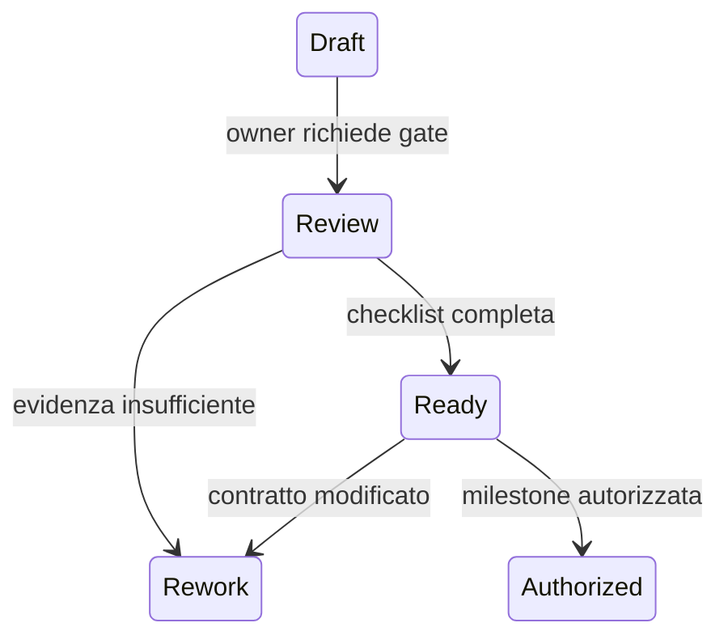

# Definition of Ready

## Scopo

Stabilire il gate oggettivo che una feature o un sistema deve superare prima di essere autorizzato all'implementazione.

## Descrizione

Ready non significa “descritto”: significa che obiettivo, confini, contratti, rischi e verifica sono abbastanza stabili da evitare riprogettazione fondazionale durante lo sviluppo.

## Ambito

Sistemi, feature, contenuti sistemici e milestone. Non autorizza codice finché la direzione non apre esplicitamente la fase di implementazione.

## Checklist obbligatoria

- [ ] System ID, owner, reviewer, priorità, complessità e livello S4 assegnati.
- [ ] Obiettivo, incluso, escluso e risultato per il giocatore approvati.
- [ ] FR P0/P1 e NFR verificabili, con ID e criteri di accettazione.
- [ ] Vincoli storici classificati e fonti collegate, quando applicabili.
- [ ] Dati posseduti/letti/modificati coerenti con la matrice di ownership.
- [ ] Input, output, comandi, query ed eventi definiti.
- [ ] Dipendenze dirette e inverse senza cicli vietati.
- [ ] Stati, transizioni, invarianti, flusso nominale, alternative ed errori coperti.
- [ ] Persistenza, migrazione, recovery e configurazione progettati.
- [ ] Budget o metodo di misurazione per performance e scalabilità approvati.
- [ ] Rischi con mitigazione, trigger e contingency registrati.
- [ ] Strategia di test e tracciabilità requisito-accettazione complete.
- [ ] Nessuna domanda bloccante aperta per la milestone.
- [ ] Documenti impattati, backlog e readiness aggiornati.

## Flusso e stati

## Flussi alternativi e casi limite

Una decisione tecnica differita è ammessa soltanto se le alternative rispettano lo stesso contratto. Una feature di ricerca può entrare in spike con scope e scadenza separati, ma non è Ready per produzione. Un requisito storico incerto può procedere se la classe di evidenza, l'adattamento e il rischio sono espliciti.

## Gestione degli errori

Checklist incompleta, evidenze contraddittorie o dipendenza sotto S3 producono stato Rework, owner e data di riesame. Nessun criterio può essere dichiarato “non applicabile” senza motivazione revisionata.

## Strategie di test

Audit delle sezioni e degli ID, walkthrough interdisciplinare, scenario nominale/errore, controllo link, ownership e dipendenze, confronto con milestone e budget.

## Criteri di accettazione

- Ogni casella ha evidenza collegata.
- Ogni requisito P0/P1 ha almeno un criterio e una strategia di test.
- La [matrice di readiness](implementation-readiness-matrix.md) segna S4.
- Il reviewer di disciplina diversa approva il gate.

## Definition of Done

Il gate è ripetibile, auditabile e applicato uniformemente; eccezioni e regressioni di readiness sono registrate, non implicite.

## Dipendenze

- [Standard di specifica](../../00-governance/system-specification-standard.md)
- [Template di sistema](../../appendices/templates/system-spec-template.md)
- [Matrice delle dipendenze](../../00-governance/system-dependency-matrix.md)

## Collegamenti agli altri documenti

- [Definition of Done](definition-of-done.md)
- [Roadmap di prodotto](product-roadmap.md)
- [Questioni aperte](../../00-governance/open-questions.md)

## Decisioni ancora aperte

- Owner nominativi e cadenza formale dei gate dipendono dalla struttura del team.

## TODO

- Integrare il gate nella futura pipeline documentale e nel backlog della demo.
