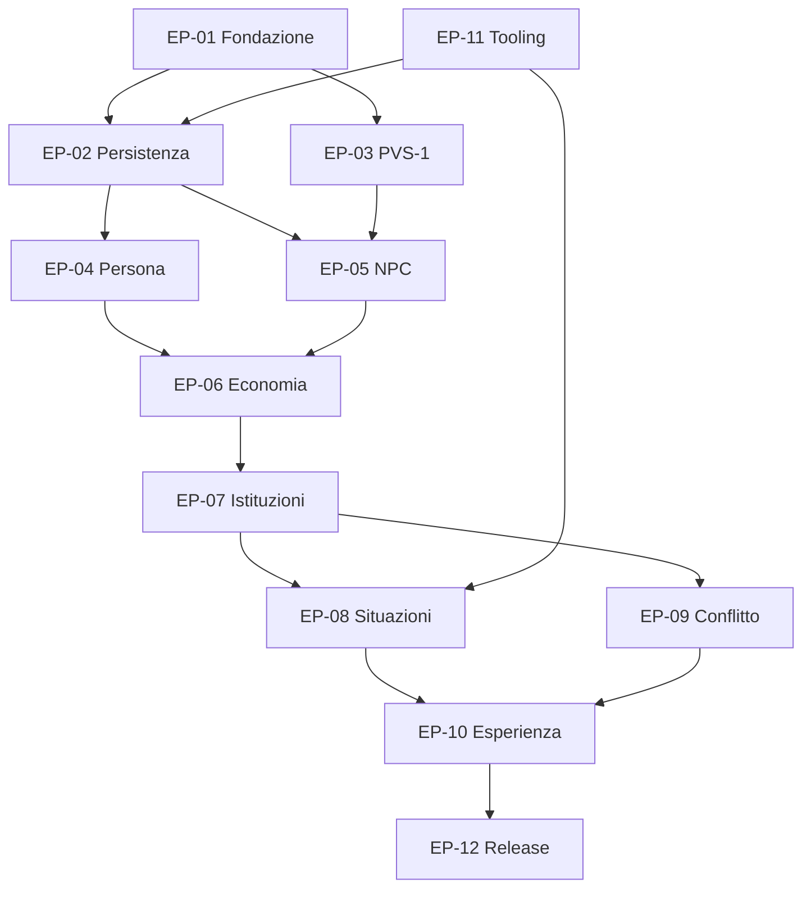

# Epic della demo di Pompei

**ID:** PRD-DEMO-EPICS-001
**Stato:** Baseline S3

## Scopo

Raggruppare il lavoro della vertical slice in risultati giocabili con confini, dipendenze e criteri di chiusura.

## Descrizione

Gli epic non corrispondono ai reparti. Ognuno produce una capacità end-to-end verificabile e include design, dati, strumenti, contenuti, UX, audio, test e documentazione.

## Ambito

Dodici epic per la demo; codice e asset non sono autorizzati da questo catalogo.

## Catalogo

| ID | Epic | Risultato | Priorità | Dipendenze | Milestone target |
|---|---|---|---:|---|---|
| EP-01 | Fondazione riproducibile | progetto futuro, moduli, CI, logging, test map | Must | READY approvata | prototipo tecnico |
| EP-02 | Tempo e mondo persistente | 30 giorni, tier, eventi e save coerenti | Must | EP-01 | prototipo tecnico |
| EP-03 | Pompei PVS-1 | percorso continuo, accessi e streaming | Must | EP-01, GIS | pre-alpha |
| EP-04 | Persona e vita quotidiana | tre origini, bisogni, salute, inventario | Must | EP-02 | prototipo gameplay |
| EP-05 | NPC e società | routine, conoscenza, relazioni, reputazione, folla | Must | EP-02, EP-03 | pre-alpha |
| EP-06 | Lavoro ed economia | tre loop P0, mercato, credito e ledger | Must | EP-04, EP-05 | pre-alpha |
| EP-07 | Status, famiglia e istituzioni | capacità, household, culto, diritto e successione | Must | EP-04–06 | vertical slice |
| EP-08 | Situazioni e dialoghi | contenuti epistemici con fallimento/aftermath | Must | EP-05–07 | vertical slice |
| EP-09 | Crimine e conflitto | furto/frode/aggressione, testimoni, rissa/trauma | Should | EP-04, EP-05, EP-07 | vertical slice |
| EP-10 | UX, accessibilità e audio | esperienza leggibile, non onnisciente e adattiva | Must | EP-03–09 | vertical slice |
| EP-11 | Tooling, dati e osservabilità | editor/validator/debug/profiler P0 | Must | EP-01, schemi | da prototipo tecnico a slice |
| EP-12 | Qualità e pubblicazione | benchmark, soak, localizzazione, release e rollback | Must | tutti | demo interna/pubblicabile |

## Criteri per epic

Ogni epic è chiuso soltanto quando tutte le feature Must sono Done, scenari nominali/alternativi/errore passano, budget e fonti sono verificati, contenuti as-built documentati e debito residuo accettato. La semplice integrazione tecnica non chiude un epic.

## Grafo

## Dipendenze

- [Mandato demo](../../07-pompeii-demo/design/demo-charter.md)
- [Scope sistemi](../../07-pompeii-demo/design/demo-systems-scope.md)
- [Milestone](milestones.md)

## Collegamenti agli altri documenti

- [Backlog](demo-backlog.md)
- [DoR](definition-of-ready.md)
- [DoD](definition-of-done.md)
- [Rischi](../risk-register.md)

## Decisioni ancora aperte

- Owner nominali e capacità del team.
- Feature Should che sopravvivono ai benchmark.

## Criteri di completamento

Epic mappati a feature, user story, test, rischio, owner e milestone senza dipendenze circolari.

## TODO

- Assegnare owner dopo definizione del team.
- Stimare range dopo prototipi e velocity osservata.
