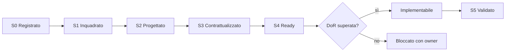

# Matrice di readiness per l'implementazione

## Scopo

Rendere verificabile quando un sistema è sufficientemente progettato per entrare in implementazione, senza confondere la presenza di un file con la maturità del suo contenuto.

## Descrizione

La matrice usa i livelli S0–S5 dello [standard di specifica](../../00-governance/system-specification-standard.md). Nessun sistema può entrare in sviluppo prima di S4 e del superamento della Definition of Ready; S5 richiede validazione interdisciplinare.

## Ambito

Tutti i sistemi del catalogo canonico, inclusi servizi trasversali. La matrice misura readiness documentale, non avanzamento del codice.

## Criteri di valutazione

| Dimensione | Evidenza richiesta per S4 |
|---|---|
| identità e confini | owner, responsabilità, esclusioni, glossario |
| requisiti | FR/NFR/vincoli storici identificati e verificabili |
| contratti | input, output, dati, comandi, query ed eventi versionabili |
| comportamento | stati, transizioni, flussi e invarianti |
| integrazione | dipendenze dirette, inverse e documenti impattati |
| qualità | errori, persistenza, performance, scalabilità e configurazione |
| delivery | priorità, complessità, rischi, test, accettazione e DoD |
| decisioni | nessun blocco incompatibile con la milestone |

## Stato iniziale dei sistemi

| ID | Sistema | Livello | Lacuna principale | Milestone documentale |
|---|---|---:|---|---|
| SYS-TIME | tempo e calendario | S3 | budget e contratti puntuali | Fondazioni AAA |
| SYS-EVT | eventi | S4 | tecnologia differita non bloccante | Fondazioni AAA |
| SYS-ID | identità | S3 | registry fisico, alias e benchmark | Fondazioni AAA |
| SYS-WORLD | mondo e spazio | S3 | budget GIS/streaming e autorità delle trasformazioni | Vertical slice Pompei |
| SYS-SIM | orchestrazione simulazione | S3 | budget quantitativi e recovery | Fondazioni AAA |
| SYS-PER | persona/ciclo di vita | S3 | regole storiche e UX successione | Simulazione sociale |
| SYS-SAVE | persistenza | S3 | formato fisico, policy versioni e benchmark | Fondazioni AAA |
| SYS-KNOW | conoscenza | S3 | budget memoria e policy di sintesi | Simulazione sociale |
| SYS-NPC | decisione NPC | S3 | budget e catalogo azioni demo | Simulazione sociale |
| SYS-REL | relazioni | S3 | budget edge e review dati sensibili | Simulazione sociale |
| SYS-HH | famiglia/successione | S3 | matrice P0 e casi giuridici | Simulazione sociale |
| SYS-STAT | status | S3 | matrice Pompei status-atto | Istituzioni |
| SYS-ECO | economia | S3 | valori storici, budget e tuning | Economia Pompei |
| SYS-PROP | proprietà | S3 | catasto e regole per status demo | Economia Pompei |
| SYS-INV | inventario | S2 | lotti, custodia, decadimento | Economia Pompei |
| SYS-WORK | professioni/produzione | S3 | professioni P0, valori e luoghi | Economia Pompei |
| SYS-INT | interazione | S2 | stati di contesa/interruzione | Gameplay slice |
| SYS-CONT | situazioni/missioni | S3 | catalogo e golden situations P0 | Esperienza slice |
| SYS-DYN | eventi dinamici | S3 | frequenze, hazard e budget Pompei | Esperienza slice |
| SYS-NARR | narrazione emergente | S3 | corpus storylet e budget thread | Esperienza slice |
| SYS-REP | reputazione | S2 | separazione da conoscenza | Simulazione sociale |
| SYS-NEED | bisogni | S2 | curve e soglie | Gameplay slice |
| SYS-UI | interfaccia | S3 | prototipi, target e test accessibilità | Esperienza slice |
| SYS-AUDIO | audio | S3 | corpus, budget, mix e lingue P0 | Esperienza slice |
| SYS-RELIG | religione | S3 | culti, autorità e calendario P0 | Istituzioni |
| SYS-POL | politica | S3 | competenze e procedure Pompei | Istituzioni |
| SYS-CRIME | criminalità | S3 | casi e pene P0 validati | Istituzioni |
| SYS-COMBAT | combattimento | S3 | controllo P0, budget, animazione e UX | Gameplay slice |
| SYS-WAR | guerra | S3 | profilo storico, budget M0–M5 e confini demo | Post-slice |
| SYS-AUTH | autorizzazioni/transazioni | S3 | modello di rollback | Fondazioni AAA |
| SYS-HIST | provenienza storica | S2 | corpus golden e workflow di waiver | Fondazioni AAA |
| SYS-DBG | diagnostica | S3 | tecnologia, SLO e retention approvati | Fondazioni AAA |

## Stato del gate della demo

**NON READY.** Diversi sistemi P0 sono S2/S3 e nessuno può essere promosso automaticamente. La checklist [READY_FOR_IMPLEMENTATION](../../READY_FOR_IMPLEMENTATION.md) richiede S4, evidenze, firme interdisciplinari e autorizzazione esplicita prima del codice.

## Gate di avanzamento

## Regole operative

- Il livello è il minimo delle dimensioni, non una media.
- Un TODO critico impedisce S4; un'estensione P3/P4 può essere differita.
- Ogni promozione cita evidenze e revisori.
- Una modifica a un contratto può retrocedere i sistemi dipendenti.
- La matrice viene aggiornata nella stessa modifica dei documenti sorgente.

## Strategie di test

- audit automatico delle sezioni obbligatorie;
- controllo dei riferimenti agli ID canonici;
- review incrociata design/engineering/QA/storia;
- walkthrough di almeno un flusso nominale, alternativo e di errore;
- tracciabilità tra requisiti e criteri di accettazione.

## Criteri di accettazione

- Tutti i sistemi del catalogo sono presenti una sola volta.
- Ogni livello ha lacuna, owner previsto e milestone.
- Nessun sistema marcato S4 conserva decisioni bloccanti per la milestone.
- Le dipendenze P0 sono almeno S3 prima che un consumer raggiunga S4.

## Definition of Done

La matrice è verificata durante ogni gate documentale, allineata a roadmap, rischi e questioni aperte, e approvata dai responsabili delle discipline coinvolte.

## Dipendenze

- [Catalogo dei sistemi](../../00-governance/system-catalog.md)
- [Standard di specifica](../../00-governance/system-specification-standard.md)
- [Definition of Ready](definition-of-ready.md)
- [Roadmap di prodotto](product-roadmap.md)

## Collegamenti agli altri documenti

- [Matrice delle dipendenze](../../00-governance/system-dependency-matrix.md)
- [Registro dei rischi](../risk-register.md)
- [Questioni aperte](../../00-governance/open-questions.md)
- [Checklist READY](../../READY_FOR_IMPLEMENTATION.md)

## Decisioni ancora aperte

- Assegnare owner nominativi quando saranno definite composizione e responsabilità del team.
- Approvare i budget quantitativi che separano S3 da S4 per simulazione e performance.

## TODO

- Collegare ogni riga alla checklist di review della relativa milestone.
- Rieseguire la valutazione dopo ogni macroarea completata.
