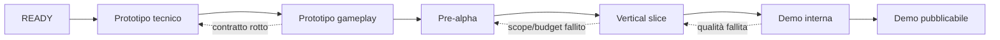

# Milestone della demo di Pompei

**ID:** PRD-DEMO-MILESTONES-001
**Stato:** Baseline sequenziale; date e staffing aperti

## Scopo

Ordinare l'esecuzione in sei fasi con risultati, entry/exit criteria e regole di taglio.

## Descrizione

Le milestone sono quality gate, non date arbitrarie. Nessuna fase eredita debito blocker dalla precedente. Range temporali saranno stimati solo dopo team, toolchain e prototipo tecnico.

## Ambito

Dal primo codice autorizzato alla demo pubblicabile. Questa pianificazione non autorizza l'avvio.

## M1 — Prototipo tecnico (PT)

**Obiettivo:** provare fondazioni e rischi irreversibili con placeholder.

**Entry:** [READY](../../READY_FOR_IMPLEMENTATION.md) interamente approvata; branch di implementazione separato; toolchain e hardware baseline.

**Scope:** F-001–007, F-037, F-039; test map minimale; tempo, evento, persona record, routine elementare, interazione, inventario e save; spike Mass/fallback, streaming e schema.

**Exit:** build CI riproducibile; golden save con recovery; record indipendenti da Actor; simulazione accelerata; benchmark iniziale; ADR delle tecnologie; zero blocker.

**Non obiettivo:** città artistica, contenuti definitivi, tre percorsi completi.

## M2 — Prototipo di gameplay (PG)

**Obiettivo:** dimostrare che il loop quotidiano è comprensibile e piacevole in uno spazio ridotto.

**Entry:** PT accettato, budget misurati, scope riconfermato.

**Scope:** graybox di due hub collegati; tre origini grezze; panificazione minimale; bisogno, lavoro, relazione, dialogo e conseguenza; UI debug + prima UX.

**Exit:** 60–90 minuti giocabili; tre onboarding; un loop economico chiuso; un evento con memoria; playtest causalità; nessuna dipendenza tecnica non mitigata.

## M3 — Pre-alpha (PA)

**Obiettivo:** integrare tutti i sistemi P0 sull'area PVS-1 graybox.

**Entry:** PG dimostra loop e controllo; GIS e catalogo edifici P0 bloccati.

**Scope:** F-008–020, F-022, F-027–028, F-033–034, F-038–040; NPC tier, tre professioni, knowledge/reputation, strumenti authoring.

**Exit:** percorso continuo; tre giorni giocabili per origine; tutte le feature P0 integrate almeno una volta; save/load; 30 giorni soak; content pipeline operativa.

## M4 — Vertical slice (VS)

**Obiettivo:** raggiungere qualità rappresentativa in un percorso completo e copertura funzionale negli altri due.

**Entry:** PA senza blocker; budget e contenuti riconfermati.

**Scope:** F-021–036; situazione comune, famiglia/successione, culto, crimine/conflitto, UI/audio/accessibilità e ambiente target in area selezionata.

**Exit:** cittadino 5–7 ore a qualità target; liberta e schiavo golden completi; DA-01–10 passano internamente; feature Should tagliate o accettate; content lock candidato.

## M5 — Demo interna (DI)

**Obiettivo:** validare stabilità, comprensione, storia, rappresentazione e costi con utenti interni/controllati.

**Entry:** VS feature complete; nessun blocker/critical noto non pianificato.

**Scope:** F-041–044; QA completa, localizzazione italiana, mix, accessibility matrix, performance, migration, fault injection, playtest e polish guidato da dati.

**Exit:** tutti i percorsi completabili senza debug; soglie UX/performance/save raggiunte; zero blocker/critical; rischi residui accettati; release candidate.

## M6 — Demo pubblicabile (DP)

**Obiettivo:** produrre un artifact distribuibile, supportabile e coerente con la promessa pubblica.

**Entry:** DI firmata; piattaforma, rating, legal, privacy, licenze e canale approvati.

**Scope:** hardening, packaging, compliance, release notes, support, rollback, build finale e documentazione as-built.

**Exit:** [Definition of Done](definition-of-done.md) e [demo acceptance](../../07-pompeii-demo/design/demo-acceptance.md) complete; artifact immutabile; smoke install/update/uninstall; rollback; sign-off multidisciplinare.

## Sequenza e regressione

Regredire una milestone è corretto quando cambia un contratto fondazionale; non si nasconde la regressione con waiver generici.

## Dipendenze

- [Backlog](demo-backlog.md)
- [Epic](epics.md)
- [Pipeline](../../10-technical/pipelines/pipeline-overview.md)
- [Budget](../../10-technical/performance/performance-strategy.md)

## Collegamenti agli altri documenti

- [Roadmap prodotto](product-roadmap.md)
- [Release readiness](../testing/release-readiness.md)
- [Rischi](../risk-register.md)

## Decisioni ancora aperte

- Team, capacità, calendario e criteri di forecast.
- Canale/piattaforma della demo pubblicabile.
- Qualità artistica target e contenuti Should.

## Criteri di completamento

Ogni milestone ha owner, review calendar, feature assegnate, entry/exit misurabili, contingency e artifact atteso.

## TODO

- Stimare range dopo PT.
- Collegare milestone a dashboard e release train futuri.
