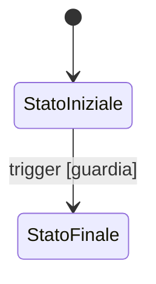

# Template — Specifica AAA di sistema

> Copiare questo file per creare una specifica. Eliminare le istruzioni tra parentesi quadre, conservare gli identificatori e collegare ogni requisito a test e criteri di accettazione.

**System ID:** `SYS-[DOMINIO]`

**Stato:** S0 | S1 | S2 | S3 | S4 | S5

**Owner / reviewer:** [ruoli]

**Priorità:** P0 | P1 | P2 | P3 | P4

**Complessità:** XS | S | M | L | XL

**Versione / ultima review:** [semver / data]

## Scopo

[Responsabilità unica e risultato verificabile.]

## Descrizione

[Visione del sistema, valore per giocatore e team, sintesi del modello mentale.]

## Ambito

### Incluso

- [Funzioni possedute.]

### Escluso e non-obiettivi

- [Responsabilità delegate e feature esplicitamente escluse.]

## Contesto e vincoli storici

| ID | Regola | Periodo/luogo | Classe evidenza | Fonte canonica | Adattamento ammesso |
|---|---|---|---|---|---|
| HIS-[SYS]-001 | [regola] | [contesto] | A–E | [link] | [limite] |

## Requisiti funzionali

| ID | Requisito verificabile | Priorità | Fonte | Criterio associato |
|---|---|---:|---|---|
| FR-[SYS]-001 | Il sistema deve… | P0 | [link] | ACC-[SYS]-001 |

## Requisiti non funzionali

| ID | Attributo | Soglia o metodo di misura | Scenario | Piattaforma |
|---|---|---|---|---|
| NFR-[SYS]-001 | [latenza/determinismo/usabilità] | [budget] | [carico] | [target] |

## Vincoli progettuali

- `CON-[SYS]-001` — [guardrail non negoziabile].

## Dipendenze

### Sistemi utilizzati

| Sistema | Contratto usato | Criticità | Modalità | Degradazione |
|---|---|---|---|---|
| [SYS-X] | [CMD/QRY/EVT] | hard/soft | sync/async | [fallback] |

### Sistemi dipendenti

| Sistema | Contratto esposto | Compatibilità richiesta |
|---|---|---|
| [SYS-Y] | [contratto] | [versione/policy] |

## Input e output

| ID | Direzione | Tipo logico | Origine/destinazione | Validazione | Errore |
|---|---|---|---|---|---|
| CMD-[SYS]-001 | input | [comando] | [sistema] | [regole] | ERR-[categoria] |
| QRY-[SYS]-001 | output | [vista] | [consumer] | [policy] | [fallback] |

## Dati e autorità

| Dato | Possiede | Legge | Modifica | Persistenza | Retention/migrazione |
|---|---:|---|---|---|---|
| [aggregato] | sì/no | [fonti] | [modalità] | [scope] | [policy] |

Invarianti:

- `INV-[SYS]-001` — [condizione sempre vera].

## Eventi generati

| ID evento | Condizione | Payload minimo | Consumatori | Persistenza |
|---|---|---|---|---|
| EVT.[Dominio].[Fatto].v1 | [trigger] | [campi] | [sistemi] | [policy] |

## Eventi ricevuti

| ID evento | Produttore | Reazione | Idempotenza | Fuori ordine |
|---|---|---|---|---|
| [evento] | [sistema] | [effetto] | [chiave] | [policy] |

## Stati e transizioni

| Stato | Ingresso | Uscita | Timeout | Stato persistito |
|---|---|---|---|---:|
| ST-[SYS]-001 | [guardia] | [trigger] | [policy] | sì/no |

## Flussi principali

### FL-[SYS]-001 — [nome]

1. [Precondizione e iniziatore.]
2. [Validazione.]
3. [Mutazione autorevole.]
4. [Evento ed esito osservabile.]

## Flussi alternativi e casi limite

| ID | Condizione | Comportamento | Dati preservati | Segnale al giocatore/team |
|---|---|---|---|---|
| EDGE-[SYS]-001 | [caso] | [risoluzione] | [stato] | [feedback] |

## Gestione degli errori

| Categoria | Rilevazione | Recovery | Retry | Telemetria |
|---|---|---|---|---|
| validazione | [regola] | nessuna mutazione | no | contatore |

## Persistenza dei dati

[Snapshot, journal, versionamento, migrazione, recovery, compatibilità e ricostruzione.]

## Configurabilità e bilanciamento

| ID | Parametro | Range | Default | Owner | Runtime |
|---|---|---|---|---|---:|
| CFG-[SYS]-001 | [nome] | [range] | [valore] | [ruolo] | sì/no |

## Prestazioni attese e scalabilità

[Budget misurabile, profili L0–L4, frequenza, carico massimo, back-pressure e comportamento degradato.]

## Modularità e documenti impattati

- API/contratti pubblici: [elenco].
- Dettagli sostituibili: [elenco].
- Documenti da aggiornare se cambia il contratto: [link].

## Priorità e complessità

[Motivazione della priorità, driver di complessità, dipendenze di delivery e fasi.]

## Rischi progettuali

| ID | Rischio/failure mode | Probabilità | Impatto | Trigger | Mitigazione | Contingency |
|---|---|---:|---:|---|---|---|
| R-[SYS]-001 | [rischio] | [L/M/H] | [L/M/H/C] | [segnale] | [azione] | [fallback] |

## Strategie di test

- unità del modello e invarianti;
- contratti di input/output/evento;
- integrazione e transazioni;
- simulazione longitudinale e soak;
- performance ai livelli di carico;
- migrazione, recovery e determinismo;
- UX/accessibilità e validazione storica, quando applicabili.

## Criteri di accettazione

- `ACC-[SYS]-001` — Given [contesto], when [azione], then [esito misurabile].

## Definition of Done

- [ ] Requisiti P0/P1 tracciati e approvati.
- [ ] Dati, autorità, contratti ed eventi coerenti con i registri canonici.
- [ ] Flussi nominali, alternativi, errori e casi limite coperti.
- [ ] Budget, configurazione e livelli di simulazione definiti.
- [ ] Test e criteri di accettazione verificabili.
- [ ] Rischi, decisioni e debito residuo registrati.
- [ ] Link, diagrammi e documenti impattati validati.
- [ ] Review interdisciplinare conclusa.

## Collegamenti agli altri documenti

- [Standard di specifica](../../00-governance/system-specification-standard.md)
- [Catalogo dei sistemi](../../00-governance/system-catalog.md)
- [Matrice delle dipendenze](../../00-governance/system-dependency-matrix.md)
- [Proprietà dei dati](../../10-technical/data/data-ownership-matrix.md)
- [Contratti degli eventi](../../10-technical/architecture/event-contracts.md)
- [Matrice di readiness](../../11-production/roadmap-backlog/implementation-readiness-matrix.md)

## Decisioni ancora aperte

| ID | Decisione bloccante | Owner | Scadenza/gate | Criterio di chiusura |
|---|---|---|---|---|
| Q-[SYS]-001 | [domanda] | [ruolo] | [milestone] | [evidenza] |

## TODO

- [Attività documentale concreta, owner e criterio di chiusura.]
