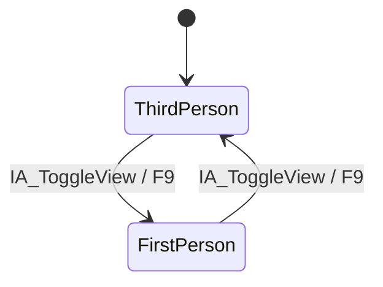

# Camera system — first/third person prototype

## Objective and scope

Allow an instantaneous, repeatable switch between first and third person on the same `ARACharacter`. Camera state never recreates, teleports or repossesses the pawn.

## State model

`ERAViewMode` is the explicit authority with two values: `FirstPerson` and `ThirdPerson`. `InitialViewMode` is configurable and defaults to third person; `CurrentViewMode` is the runtime state.

## Third-person camera

- `USpringArmComponent`, initial arm length 350 cm.
- Pawn-control rotation enabled; camera itself does not duplicate controller rotation.
- collision probe enabled on the Camera channel with a 12 cm probe;
- camera lag enabled at a conservative technical value;
- initial FOV 85°;
- Character movement rotates toward movement at 540°/s.

## First-person camera

- Attached to the collision capsule at a technical eye height of 68 cm above capsule origin.
- Uses controller rotation and initial FOV 90°.
- Shares capsule, movement, velocity and pawn state with third person.
- Hides the prototype head and body while active.

## Transition contract

`SetViewMode` changes one enum and calls `ApplyViewMode`. Exactly one camera becomes active; prototype visibility is updated and one non-shipping log entry records the new mode. Re-selecting the current mode is a no-op. No Tick, blend actor, pawn recreation or duplicate state is used.

## Risks and limits

- The transition is intentionally instant; comfort evaluation and optional blending require playtest.
- There is no first-person body rendering or animation-specific head masking.
- Camera collision must be physically confirmed at walls, narrowing and bend.
- FOV and arm length are technical defaults, not final accessibility settings.

## Tests and acceptance

Automation switches modes twice and checks enum plus mutually exclusive camera activation. The [manual test](../testing/PLAYABLE_FOUNDATION_MANUAL_TEST.md) verifies repeated `F9`, continuity during movement and wall collision.

## Related documents

- [Player Character](PLAYER_CHARACTER.md)
- [Enhanced Input](ENHANCED_INPUT.md)
- [TechnicalSandbox](TECHNICAL_SANDBOX.md)
