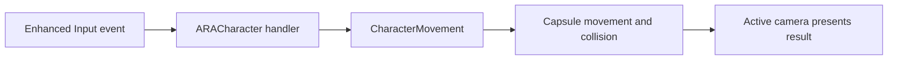

# Player Character — playable foundation

## Objective

Provide one lightweight, controllable Character for the technical slice without implementing later traversal, animation or gameplay domains.

## Scope

`ARACharacter` owns locomotion configuration, camera-relative movement, sprint state, jumping, prototype visuals, Enhanced Input bindings and the current view mode. `ARAPlayerController` remains the possession/controller boundary, while `ARAGameModeBase` selects both classes.

## Runtime structure

| Element | Responsibility |
|---|---|
| `UCapsuleComponent` | authoritative collision and gravity body |
| `UCharacterMovementComponent` | walk, sprint, air control, slope response and rotation interpolation |
| `PlaceholderBody` / `PlaceholderHead` | visible third-person technical proxy; no gameplay collision |
| camera components | presentation only; see [camera system](CAMERA_SYSTEM.md) |
| input objects | action definitions and mapping context; see [Enhanced Input](ENHANCED_INPUT.md) |

The class has no custom Tick. Input events call standard `ACharacter` and `UCharacterMovementComponent` operations.

## Configurable defaults

| Property | Initial value | Constraint |
|---|---:|---|
| Walk speed | 300 cm/s | positive |
| Sprint speed | 600 cm/s | greater than walk speed |
| Jump velocity | 420 cm/s | positive |
| Air control | 0.35 | technical tuning only |
| Rotation rate | 540°/s yaw | avoids instant body rotation |
| Look sensitivity | 1.0 | positive |

Values are `EditDefaultsOnly` where appropriate and are centralized in the class defaults. They are design placeholders, not final balance.

## Main flow

Movement uses controller yaw to derive forward and right vectors, so both cameras share identical locomotion state. Sprint changes only `MaxWalkSpeed`; releasing the action restores the configured walk speed.

## Dependencies and outputs

- Uses: Engine Character framework, Enhanced Input, `ARAPlayerController` and `ARAGameModeBase`.
- Produces: movement, jump and view-mode state; one Development log only when the camera mode changes.
- Persistence: none in this milestone.
- Error handling: input setup uses `ensureMsgf` if an incompatible input component is supplied.

## Edge cases and limits

- No crouch, parkour, climbing, combat, lock-on, motion matching or final animation blueprint.
- The placeholder mesh is hidden in first person to prevent camera obstruction.
- Sprint is a held action; focus-loss flushing is delegated to Engine input settings.
- Controller/gamepad mappings and rebinding UI are future work.

## Verification and completion

Automation validates non-null critical references, valid speeds and the default third-person state. Physical movement and traversal follow the [manual test](../testing/PLAYABLE_FOUNDATION_MANUAL_TEST.md). The system is complete for this milestone after that checklist passes without crash or critical warning.

## Canonical links

- [Camera system](CAMERA_SYSTEM.md)
- [Enhanced Input](ENHANCED_INPUT.md)
- [TechnicalSandbox](TECHNICAL_SANDBOX.md)
- [Technical debt](../../10-technical/architecture/technical-debt-register.md)
